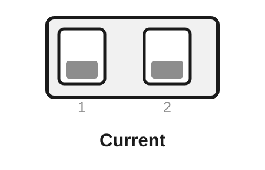
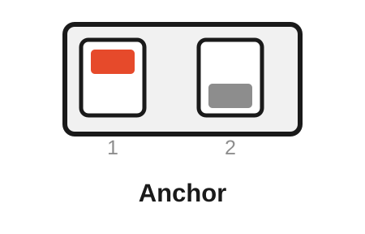
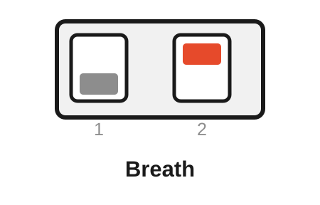
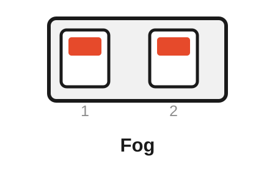
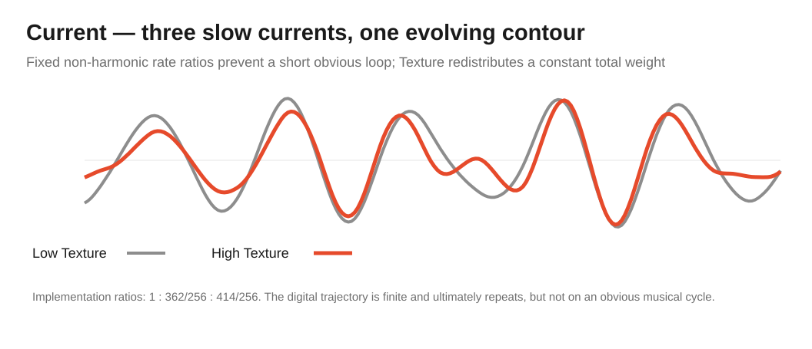
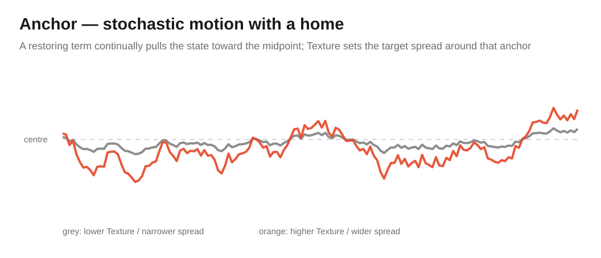
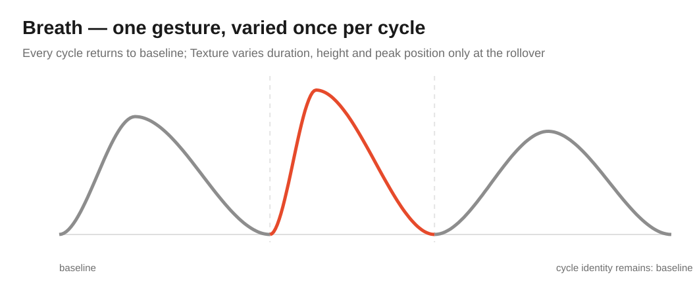
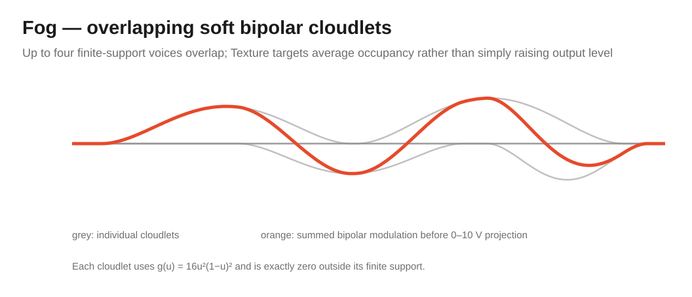

# Free Modular Drift — Ambient Algorithm Bank

[← Main README](README.md) · [Classic bank](README-BANK-CLASSIC.md) · [Organic bank](README-BANK-ORGANIC.md) · [Generative bank](README-BANK-GENERATIVE.md) · [Electronica bank](README-BANK-ELECTRONICA.md) · [Percussion bank](README-BANK-PERCUSSION.md) · [User manual](docs/manual/README.md) · [Ambient engineering design](docs/analysis/algorithm-banks/ambient-bank-design.md)

The **Ambient bank** is Drift's long-form modulation bank. It contains **Current, Anchor, Breath and Fog** and deliberately slows the common Drift time scale to make room for movement that develops over phrases, sections and entire patches rather than over individual beats.

The four modes cover four different kinds of slow evolution: deterministic multi-rate drift, mean-reverting stochastic motion, recurrent macro-gestures and overlapping stochastic clouds. None is simply a slower copy of Perlin, Brownian, Bézier or Rain.

> [!NOTE]
> Ambient is included in release `0.2.0`. All four algorithms use the original hardware and a bank-wide macro-time scale of one sixteenth of the common Drift phase-rate mapping.

## Contents

- [Selecting the Ambient bank](#selecting-the-ambient-bank)
- [Rear DIP mapping](#rear-dip-mapping)
- [Controls at a glance](#controls-at-a-glance)
- [Current — deterministic long-form beating](#current--deterministic-long-form-beating)
- [Anchor — stochastic motion with a statistical home](#anchor--stochastic-motion-with-a-statistical-home)
- [Breath — recurrent swells with cycle variation](#breath--recurrent-swells-with-cycle-variation)
- [Fog — overlapping bipolar cloudlets](#fog--overlapping-bipolar-cloudlets)
- [Hardware and implementation constraints](#hardware-and-implementation-constraints)
- [Build and verification](#build-and-verification)

## Selecting the Ambient bank

Ambient is selected at compile time. The dedicated Arduino Nano environments are:

```bash
pio run -e nanoatmega328new_ambient
pio run -e nanoatmega328_ambient
```

After flashing the Ambient image, the rear DIP switches select Current, Anchor, Breath or Fog at startup.

> [!IMPORTANT]
> **Flashing chooses the bank; the rear DIP chooses the algorithm inside that bank.** DIP changes are sampled only at power-up and cannot select another firmware bank.

The bank uses the standard Speed/Texture control architecture, but the primary time scale is deliberately slowed by **16×**. This preserves Drift's familiar exponential control feel while opening characteristic times from roughly minutes down into sub-second motion.

> [!IMPORTANT]
> **Attenuation remains analogue and post-DAC.** It changes final output depth only and is never part of Current weighting, Anchor spread, Breath variation or Fog density calculations.

## Rear DIP mapping

**ON is the upper switch position.** Power-cycle the module after changing either rear switch.

<table>
<tr>
<td align="center" width="25%"><br><strong>Current</strong><br>DIP 1: OFF<br>DIP 2: OFF</td>
<td align="center" width="25%"><br><strong>Anchor</strong><br>DIP 1: ON<br>DIP 2: OFF</td>
<td align="center" width="25%"><br><strong>Breath</strong><br>DIP 1: OFF<br>DIP 2: ON</td>
<td align="center" width="25%"><br><strong>Fog</strong><br>DIP 1: ON<br>DIP 2: ON</td>
</tr>
</table>

| Rear DIP 1 | Rear DIP 2 | Algorithm | Character |
|---|---|---|---|
| **OFF** | **OFF** | **Current** | Deterministic multi-rate motion with very long practical recurrence |
| **ON** | **OFF** | **Anchor** | Bounded stochastic wandering around a statistical home |
| **OFF** | **ON** | **Breath** | Recurrent swell whose shape varies from cycle to cycle |
| **ON** | **ON** | **Fog** | Smooth bipolar stochastic cloudlets with controlled overlap |

## Controls at a glance

| Mode | Speed | Texture | Texture CV | Attenuation |
|---|---|---|---|---|
| **Current** | Shared macro rate of all three currents | Redistributes weight toward secondary currents | Adds redistribution | Final output depth |
| **Anchor** | Mean-reversion / correlation rate | Target stationary spread | Adds spread | Final output depth |
| **Breath** | Nominal swell rate | Cycle duration, height and skew variation | Adds variation | Final output depth |
| **Fog** | Cloudlet duration | Target mean cloud occupancy | Adds occupancy | Final output depth |

## Current — deterministic long-form beating

Current combines three deterministic slow currents whose phase rates approximate the non-harmonic ratio

$$
1:\sqrt{2}:\varphi.
$$

<p align="center">
  
</p>

The AVR implementation uses rational approximations

$$
1:\frac{362}{256}:\frac{414}{256},
$$

avoiding general division in the sample path while keeping the intended rate relationships close. Each phase is projected through a cubic-softened triangle.

Texture does not simply add gain. It redistributes a **constant total integer weight of 1024** from the primary current toward the two secondary currents:

$$
(768,192,64)\rightarrow(512,320,192).
$$

The constant sum keeps nominal level stable while changing how much internal detail appears.

- **Speed** — shared macro rate of all three phase currents.
- **Texture** — distribution of weight between primary and secondary currents.
- **Texture CV** — external redistribution control.
- **Attenuation** — final modulation depth.

Current is fully deterministic for fixed controls. Musically, it is useful for pads, timbre, spatial movement and slow effect modulation where a coherent contour is wanted without an obvious short LFO cycle.

Developer detail: [Current engineering analysis](docs/analysis/algorithms/current-analysis.md).

## Anchor — stochastic motion with a statistical home

Anchor is the Ambient answer to unrestricted random wandering. It can move away from centre, but its state always carries an explicit restoring tendency back toward a statistical home.

<p align="center">
  
</p>

The implemented recurrence is **Ornstein–Uhlenbeck-inspired**, but deliberately not described as an exact Gaussian OU process:

$$
x[n+1]=a\,x[n]+g(a)s(T)\xi[n].
$$

Here $\xi$ is the firmware's symmetric triangular innovation with variance $1/6$. A generated lookup table approximately compensates the innovation scale across Speed with

$$
g(a)\approx\sqrt{6(1-a^2)}.
$$

Texture maps the target spread from a deterministic centre at minimum Texture to approximately 0.30 full-scale in signed Q1.15 representation.

- **Speed** — mean-reversion and correlation rate.
- **Texture** — stationary spread around the midpoint.
- **Texture CV** — external spread control.
- **Attenuation** — final modulation depth.

Musically, Anchor is useful when a parameter should wander freely enough to feel alive but still remain associated with a home region. Unlike Brownian, its return tendency is part of the model rather than an incidental consequence of hitting bounds.

Developer detail: [Anchor engineering analysis](docs/analysis/algorithms/anchor-analysis.md).

## Breath — recurrent swells with cycle variation

Breath always preserves one recognizable macro-gesture:

$$
\text{baseline}\rightarrow\text{one peak}\rightarrow\text{baseline}.
$$

<p align="center">
  
</p>

A cubic smoothstep shapes both sides of the swell. Only at a completed cycle boundary are new variation parameters drawn and latched:

- duration multiplier `0.75..1.25`;
- peak amplitude `0.65..1.00`;
- peak position `0.25..0.50` of the cycle.

At Texture zero, those values lock to their nominal settings `1.0`, `0.825` and `0.375`, producing a repeatable reference gesture. Increasing Texture adds cycle-to-cycle variation without changing the invariant topology of one rise and one fall.

- **Speed** — nominal swell rate.
- **Texture** — amount of duration, peak-height and asymmetry variation.
- **Texture CV** — external variation control.
- **Attenuation** — final modulation depth.

Musically, Breath suits macro-dynamics, filter motion, reverb depth and other destinations where an obvious swell is desirable but exact periodic repetition sounds too mechanical.

Developer detail: [Breath engineering analysis](docs/analysis/algorithms/breath-analysis.md).

## Fog — overlapping bipolar cloudlets

Fog creates a soft stochastic field by superimposing up to four finite-duration bipolar cloudlets. Each voice follows the compact quartic kernel

$$
g(u)=16u^2(1-u)^2,
\qquad 0\le u\le1.
$$

<p align="center">
  
</p>

The kernel is exactly zero at both boundaries and reaches its peak at the midpoint, giving every event a smooth attack and release without an abrupt edge. Texture maps the target mean occupancy from **0.125 to 3.0 active voices**.

Event probability is compensated against the Speed-controlled cloud duration. Changing Speed therefore changes the length of cloudlets without accidentally turning the same Texture setting into a completely different density regime.

The four-voice ceiling is deliberate. If all four voices are active, a new event is dropped rather than allocating memory or stealing an existing voice.

- **Speed** — cloudlet duration / macro time scale.
- **Texture** — target mean number of overlapping cloudlets.
- **Texture CV** — external occupancy control.
- **Attenuation** — final modulation depth.

Musically, Fog is suited to spatial modulation, spectral depth, effect sends and slow timbral movement where discrete events should dissolve into a soft irregular texture. It is intentionally different from Rain's positive impulse-and-decay process.

Developer detail: [Fog engineering analysis](docs/analysis/algorithms/fog-analysis.md).

## Hardware and implementation constraints

Ambient uses the same physical signal path as the other continuous banks:

1. Speed CV — A4
2. Texture CV — A5
3. Speed knob — ADC6/A6
4. Texture knob — ADC7/A7
5. 12-bit MCP4922 Channel-A output
6. analogue Attenuation after the DAC
7. output-level LED derived from the generated DAC value

The AVR implementation uses fixed-point arithmetic and fixed-size state. Current uses three phase accumulators, Anchor uses generated flash lookup data for spread normalization, Breath moves random work to cycle boundaries, and Fog statically allocates four voices. None requires heap allocation in the real-time path.

The common repository resource and timing policies still apply: application flash at or below 85%, static SRAM at or below 65%, strict native compilation, sanitizer coverage and dedicated 2.5 kHz timing qualification.

## Named developer target

For on-device testing, this bank can be flashed normally with rear-DIP selection or locked to one algorithm by name. For example:

```bash
# Complete Ambient bank: rear DIP switches remain active.
pio run -e nanoatmega328new_ambient -t upload

# Named developer target: DIP switches are ignored.
FMD_FORCE_ALGORITHM=breath pio run -e nanoatmega328new_ambient -t upload
```

The cross-platform helper `python scripts/flash_drift.py algorithm breath` infers this bank automatically. Named targets are developer/test builds only; tagged releases always contain the complete four-algorithm bank.

## Build and verification

Firmware:

```bash
pio run -e nanoatmega328new_ambient
pio run -e nanoatmega328_ambient
```

Native verification:

```bash
pio test -e native_ambient
pio test -e native_ambient_sanitized
pio test -e native_ambient_coverage
```

Timing qualification uses `nanoatmega328new_ambient_timing`. Tagged releases publish Ambient images for both Nano bootloaders; see the [main README](README.md#release-artifacts) for artifact naming.

The bank-level architecture, duplication audit and musical assessment are documented in [Ambient algorithm bank design](docs/analysis/algorithm-banks/ambient-bank-design.md).

<!-- drift-footer:start -->
<p align="center">
  From Munich with 
</p>
<!-- drift-footer:end -->
