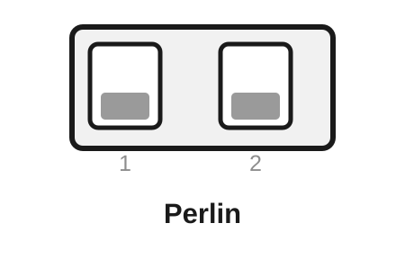
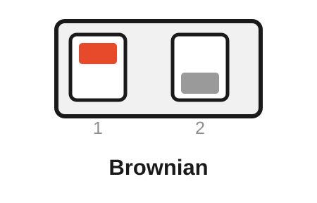
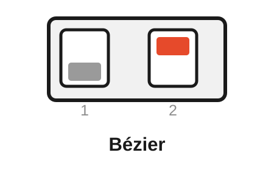
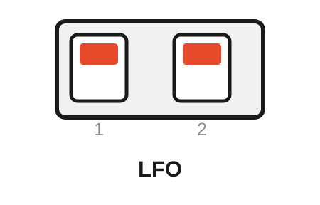
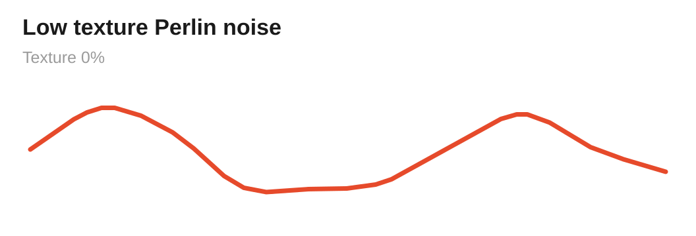
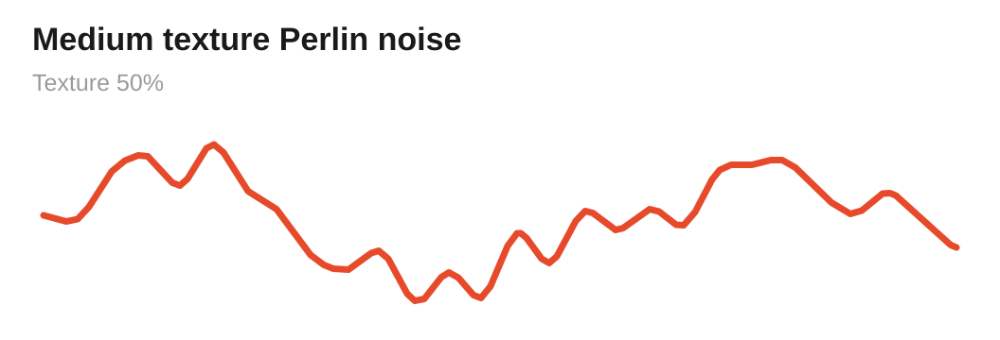
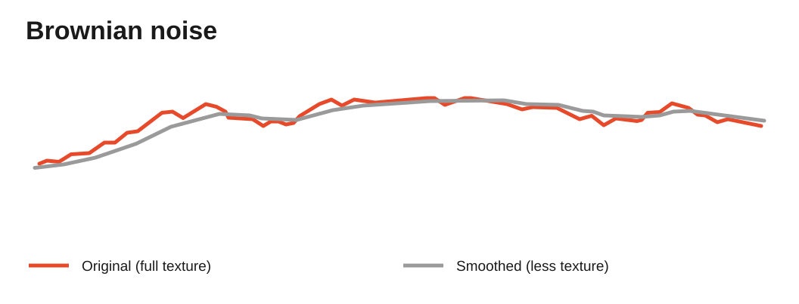
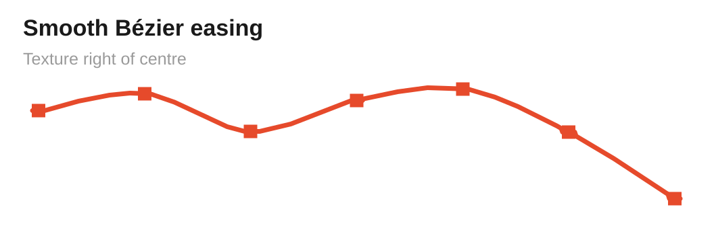
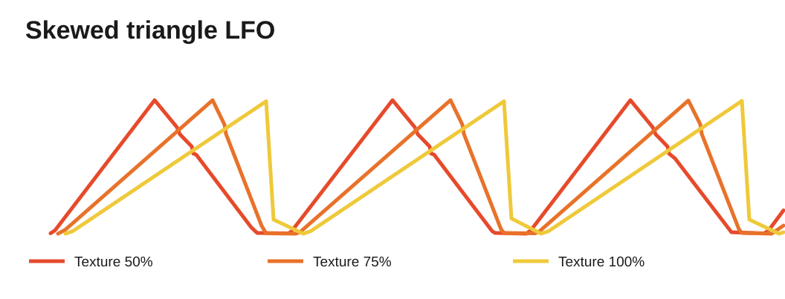

# Free Modular Drift — Classic Algorithm Bank

[← Main README](README.md) · [Organic bank](README-BANK-ORGANIC.md) · [Generative bank](README-BANK-GENERATIVE.md) · [Ambient bank](README-BANK-AMBIENT.md) · [User manual](docs/manual/README.md) · [Engineering analyses](docs/analysis/algorithms/README.md) · [Percussion bank](README-BANK-PERCUSSION.md)

The **Classic bank** is Drift's compatibility bank and the default firmware build. It contains the four algorithm concepts of Quinn Freedman's original Drift — **Perlin, Brownian, Bézier and LFO** — implemented in the C++17/PlatformIO firmware with the verified numerical and state-handling corrections documented in this repository.

> [!NOTE]
> `v0.1.0` establishes the Classic bank as the first released firmware baseline. If `FMD_ALGORITHM_BANK` is not defined, the firmware compiles as Classic.

## Contents

- [Selecting the Classic bank](#selecting-the-classic-bank)
- [Rear DIP mapping](#rear-dip-mapping)
- [Controls at a glance](#controls-at-a-glance)
- [Perlin — smooth organic movement](#perlin--smooth-organic-movement)
- [Brownian — bounded random walk with memory](#brownian--bounded-random-walk-with-memory)
- [Bézier — random destinations with shaped travel](#bézier--random-destinations-with-shaped-travel)
- [LFO — skewable periodic modulation](#lfo--skewable-periodic-modulation)
- [Classic-bank upstream findings](#classic-bank-upstream-findings)
- [Build and verification](#build-and-verification)

## Selecting the Classic bank

Classic is the default compile-time bank. These PlatformIO environments build it directly:

```bash
pio run -e nanoatmega328new
pio run -e nanoatmega328
```

The firmware image contains only the selected bank. The rear DIP switches choose one of the four algorithms **inside** that flashed bank; they do not switch between Classic, Organic, Generative and Ambient.

> [!IMPORTANT]
> **Attenuation is not a firmware input.** It sits in the analogue output path after the DAC and scales the final 0–10 V signal. The firmware reads Speed, Texture, Speed CV and Texture CV only.

## Rear DIP mapping

The two rear DIP switches are sampled at startup. **ON is the upper position.** A changed DIP setting takes effect only after a power cycle.

<table>
<tr>
<td align="center" width="25%"><br><strong>Perlin</strong><br>DIP 1: OFF<br>DIP 2: OFF<br><em>Default</em></td>
<td align="center" width="25%"><br><strong>Brownian</strong><br>DIP 1: ON<br>DIP 2: OFF</td>
<td align="center" width="25%"><br><strong>Bézier</strong><br>DIP 1: OFF<br>DIP 2: ON</td>
<td align="center" width="25%"><br><strong>LFO</strong><br>DIP 1: ON<br>DIP 2: ON</td>
</tr>
</table>

| Rear DIP 1 | Rear DIP 2 | Algorithm | Character |
|---|---|---|---|
| **OFF** | **OFF** | **Perlin** | Smooth correlated gradient noise; default |
| **ON** | **OFF** | **Brownian** | Bounded random walk with memory |
| **OFF** | **ON** | **Bézier** | Random destinations joined by shaped transitions |
| **ON** | **ON** | **LFO** | Periodic falling-saw ↔ triangle ↔ rising-saw modulation |

Leaving both configuration inputs open is electrically equivalent to `OFF / OFF`, so Perlin remains the default mode.

## Controls at a glance

| Mode | Speed | Texture knob | Texture CV | Attenuation |
|---|---|---|---|---|
| **Perlin** | Exponential traversal rate; approximately 1 V/oct with Speed CV | Blends in a second octave running 4× faster | Adds to octave blend | Final output depth |
| **Brownian** | Raises movement probability and step size; not 1 V/oct | Controls how tightly output follows the random-walk target | Adds to smoothing control | Final output depth |
| **Bézier** | Base segment rate; approximately 1 V/oct with Speed CV | Morphs curve shape and contributes to timing variation | Widens timing variation only | Final output depth |
| **LFO** | Periodic frequency; approximately 1 V/oct with Speed CV | Moves apex from falling saw through triangle to rising saw | Adds to skew/apex position | Final output depth |

## Perlin — smooth organic movement

Perlin is the default mode and the closest expression of Drift's original concept: movement that is unpredictable without becoming discontinuous. It uses one-dimensional gradient noise rather than selecting unrelated random voltages.

<table>
<tr>
<td align="center" width="50%"><br><strong>Low Texture</strong><br>Broad, slow and very smooth movement</td>
<td align="center" width="50%"><br><strong>Higher Texture</strong><br>More fine movement from the faster octave</td>
</tr>
</table>

Within one lattice segment, normalized phase $t$ and neighboring gradients $g_0$ and $g_1$ are blended with the canonical quintic fade

$$
f(t)=6t^5-15t^4+10t^3
$$

and the one-dimensional gradient-noise value

$$
n(t)=(1-f(t))g_0t+f(t)g_1(t-1).
$$

The fade reaches adjacent lattice boundaries with zero first and second derivative, which is what gives the motion its smooth continuity.

Drift combines two such layers. The second advances four times faster than the first, while Texture controls its contribution. **Speed** moves through the noise landscape with the shared exponential frequency mapping; **Texture** progressively adds the faster octave without discarding the broad base motion.

Musically, Perlin is suited to parameters that benefit from long correlated movement without an obvious cycle: timbre, filter position, spatial movement, effect depth or macro-modulation.

Developer detail: [Perlin engineering analysis](docs/analysis/algorithms/perlin-noise-analysis.md).

## Brownian — bounded random walk with memory

Brownian maintains a bounded target whose next position depends on the current position. It therefore behaves differently from random sample-and-hold: the process has **memory**, direction and inertia.

<p align="center">
  
</p>

Let the combined 10-bit Speed control be $c\in[0,1023]$. On each 2.5 kHz processing step, the target-motion probability is approximately

$$
P(\mathrm{move})=\frac{c}{1024},
$$

while the internal step magnitude is

$$
s(c)=\left\lfloor\frac{256+c}{2}\right\rfloor.
$$

Raising Speed therefore makes the walk move both **more often** and **farther**. This is why Brownian intentionally does not use the 1 V/oct frequency interpretation of Perlin, Bézier and LFO.

Texture controls a first-order follower between target $q[n]$ and visible output state $x[n]$:

$$
x[n+1]=x[n]+\alpha(T)\bigl(q[n]-x[n]\bigr).
$$

Low Texture gives strong inertia; high Texture follows the underlying walk more closely. Fractional residual is retained so very small corrections continue to accumulate instead of becoming stuck through integer truncation.

Developer detail: [Brownian engineering analysis](docs/analysis/algorithms/brownian-motion-analysis.md).

## Bézier — random destinations with shaped travel

Bézier chooses successive random destination voltages and travels between them with monotone cubic easing curves. The result has identifiable journeys from one level to another while remaining non-repeating.

<table>
<tr>
<td align="center" width="50%"><br><strong>Left of centre</strong><br>Transition-emphasised inverse easing</td>
<td align="center" width="50%"><br><strong>Right of centre</strong><br>Smooth easing into and out of destinations</td>
</tr>
</table>

The two cubic response families are

$$
C_s(t)=3t^2-2t^3
$$

and

$$
C_r(t)=2t^3-3t^2+2t.
$$

With normalized Texture position $\tau$, the knob continuously morphs between them:

$$
C(t,\tau)=(1-\tau)C_r(t)+\tau C_s(t).
$$

At the center, the average becomes effectively linear. Moving right gives smooth easing into and out of each destination; moving left emphasizes the transition itself.

Timing randomness is separate. A symmetric triangular random offset $\delta$ is applied in logarithmic speed space:

$$
f_{\mathrm{segment}}=f_{\mathrm{base}}2^{\delta}.
$$

The **Texture knob** affects both curve shape and timing variation. **Texture CV affects timing variation only**, so external CV can change the irregularity of segment durations without moving the selected curve family.

Developer detail: [Bézier engineering analysis](docs/analysis/algorithms/bezier-random-walk-analysis.md).

## LFO — skewable periodic modulation

LFO is the deterministic member of the Classic bank. Texture continuously moves the waveform apex from a falling saw through a centered triangle to a rising saw.

<p align="center">
  
</p>

For normalized phase $p$ and apex position $a$, the interior waveform is

$$
y(p,a)=
\begin{cases}
\dfrac{p}{a}, & p\le a,\\
\dfrac{1-p}{1-a}, & p>a.
\end{cases}
$$

At $a=0.5$ the waveform is a symmetric triangle. The exact endpoint cases are falling and rising sawtooths. **Speed** controls frequency with the shared approximately 1 V/oct mapping. **Texture** moves the apex without changing nominal period; live Texture changes remap phase so the current output is retained as closely as the finite fixed-point representation allows.

Use LFO when repeatability or asymmetric rise/fall timing is the musical requirement rather than stochastic evolution.

Developer detail: [LFO engineering analysis](docs/analysis/algorithms/lfo-analysis.md).

## Classic-bank upstream findings

The upstream implementation remains the design reference. The following findings materially affected the Classic bank; detailed derivations and evidence live in the developer analyses.

| Area | Upstream observation | Current treatment |
|---|---|---|
| **Brownian — Texture scaling** | Most of the 10-bit Texture range is interpreted directly as raw Q0.16, followed by a separate direct-tracking regime near the top of the control range. | Normalize the complete 0…1023 control range to a documented smoothing range and remove the abrupt regime change. |
| **Brownian — convergence** | Fractional smoothing movement is discarded, so sufficiently small non-zero corrections can quantize to zero before the target is reached. | Retain fractional residual so mathematically non-zero movement continues to accumulate. |
| **Bézier — timing distribution** | The implementation samples a triangular distribution in logarithmic speed space, although older documentation described it as Gaussian. | Keep the triangular model as the implemented musical design and document it accurately. |
| **Bézier — inverse CDF endpoint** | 256 stored values are used for 256 interpolation intervals, causing the upper interpolation index to clamp at the final entry. | Use 257 boundary samples for 256 intervals so both mathematical endpoints are represented. |
| **Bézier — curve selection** | Crossing the Texture midpoint switches directly between two cubic easing families while a segment is running. | Morph continuously between the cubic responses instead of changing family at a single ADC code. |
| **LFO — live Texture changes** | Skew/Texture is latched at cycle rollover, so changes can be delayed by almost a full cycle at slow rates. | Apply Texture immediately and remap phase to preserve the current output as closely as fixed-point resolution permits. |
| **LFO — startup state** | The constructor uses a fixed initial apex and exposes a first-cycle fixed-point edge around the peak. | Initialize and process the requested shape from the first step, removing the startup-only discontinuity. |
| **Perlin — fade evaluation** | Repeated truncating fixed-point polynomial operations can introduce local one-code reversals in an otherwise monotone quintic fade. | Evaluate the canonical quintic with a single rounded integer expression over the effective phase domain. |
| **Frequency mapping — cost** | Frequency-to-phase conversion uses a 64-bit division in a recurring hot path. | Use reciprocal multiplication plus a bounded exact correction while retaining the mathematically rounded result. |

A correction is accepted only where the intended mathematics or state behavior can be stated and tested. Differences that are part of Drift's musical character are retained even when another implementation would also be possible.

See [original firmware analysis](docs/analysis/original-firmware-analysis.md) for the broader evidence chain.

## Build and verification

Firmware:

```bash
pio run -e nanoatmega328new
pio run -e nanoatmega328
```

Native verification:

```bash
pio test -e native
pio test -e native_sanitized
pio test -e native_coverage
```

Timing qualification uses `nanoatmega328new_timing`. Tagged releases publish Classic images for both Nano bootloaders; see the [main README](README.md#release-artifacts) for artifact naming.

<!-- drift-footer:start -->
<p align="center">
  From Munich with 
</p>
<!-- drift-footer:end -->
