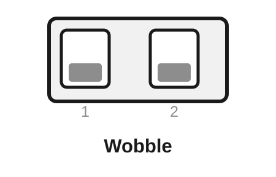
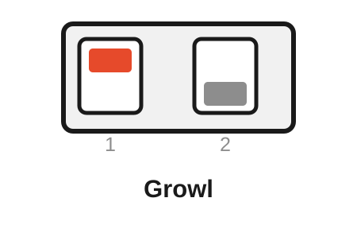
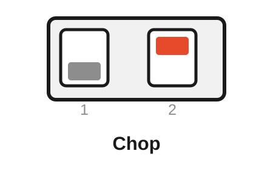
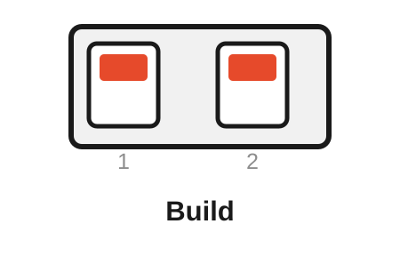
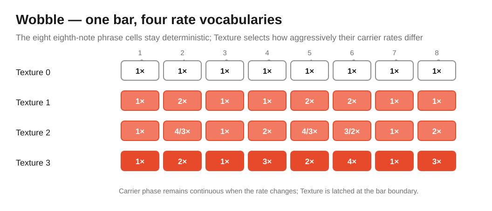
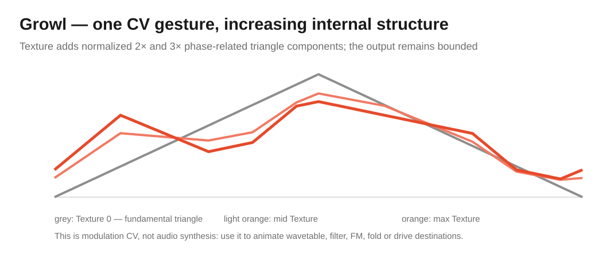
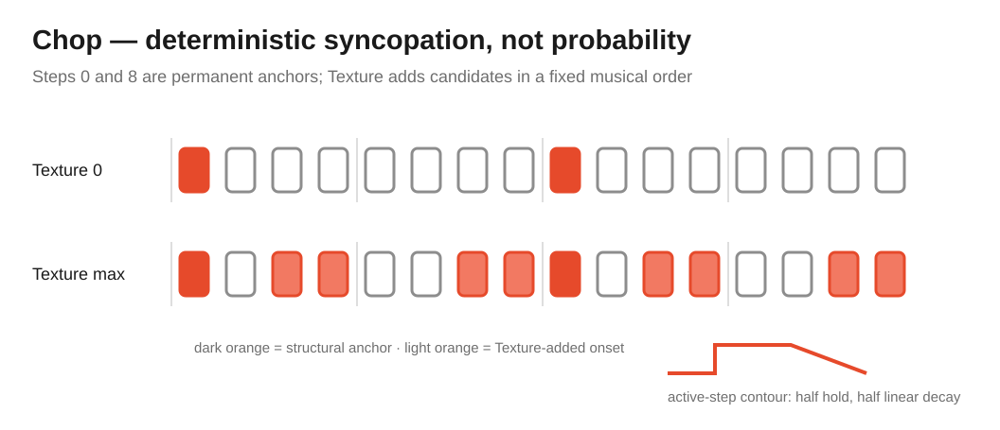
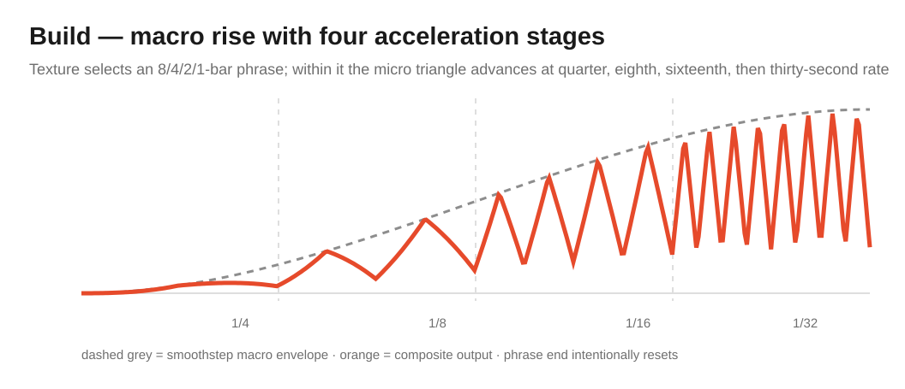

# Free Modular Drift — Dubstep / Bass Algorithm Bank

[← Main README](README.md) · [Classic bank](README-BANK-CLASSIC.md) · [Organic bank](README-BANK-ORGANIC.md) · [Generative bank](README-BANK-GENERATIVE.md) · [Ambient bank](README-BANK-AMBIENT.md) · [Electronica bank](README-BANK-ELECTRONICA.md) · [Percussion bank](README-BANK-PERCUSSION.md) · [User manual](docs/manual/README.md) · [Engineering design](docs/analysis/algorithm-banks/dubstep-bank-design.md)

The **Dubstep / Bass bank** is an **Unreleased** seventh Drift bank for tempo-relative bass modulation. It contains **Wobble, Growl, Chop and Build**: four deterministic modes operating at different musical time scales, from movement inside a beat to phrase-scale escalation across several bars.

The working bank name is intentionally descriptive rather than historical doctrine. Wobble/growl/build vocabulary is associated especially strongly with later dubstep, brostep and wider bass-music production; the algorithms are equally usable for drum & bass, breaks, UK bass, electro and harder techno. The implementation therefore treats the name as a practical navigation label, not a claim that these four processes define the whole genre.

> [!IMPORTANT]
> This bank is **post-0.2.0 and currently Unreleased**. Release `0.2.0` remains the stable six-bank / 24-algorithm release. The current source tree contains this seventh bank for development and on-device qualification.

> [!WARNING]
> In this bank **Speed CV becomes an optional 0–5 V quarter-note clock input**, using the same qualified clock source as Percussion. **Do not patch raw 10 V Eurorack clocks or triggers into Speed CV on the current hardware.** Without valid external clock lock, the Speed knob supplies the internal tempo automatically.

## Contents

- [Selecting the bank](#selecting-the-bank)
- [Rear DIP mapping](#rear-dip-mapping)
- [Clock and tempo contract](#clock-and-tempo-contract)
- [Controls at a glance](#controls-at-a-glance)
- [Wobble — tempo-quantised rate phrases](#wobble--tempo-quantised-rate-phrases)
- [Growl — compound timbral-motion CV](#growl--compound-timbral-motion-cv)
- [Chop — deterministic syncopated articulation](#chop--deterministic-syncopated-articulation)
- [Build — phrase-scale escalation](#build--phrase-scale-escalation)
- [Developer targets](#developer-targets)
- [Build and verification](#build-and-verification)

## Selecting the bank

The complete bank is selected at compile time. For an Arduino Nano with the current bootloader:

```bash
pio run -e nanoatmega328new_dubstep -t upload
```

For the legacy Nano bootloader:

```bash
pio run -e nanoatmega328_dubstep -t upload
```

The developer helper provides the same operation by name:

```bash
python scripts/flash_drift.py bank dubstep
```

A normal bank image contains all four algorithms. The rear DIP switches select the active algorithm at startup.

## Rear DIP mapping

The existing two-switch hardware truth table is unchanged:

| Rear DIP 1 | Rear DIP 2 | Algorithm | Character |
|---|---|---|---|
| **OFF** | **OFF** | **Wobble** | Tempo-quantised rate phrase driving one continuous triangle carrier |
| **ON** | **OFF** | **Growl** | Multi-lobed deterministic CV gesture for timbral destinations |
| **OFF** | **ON** | **Chop** | Sparse-to-dense syncopated bass articulation on a 16-step bar |
| **ON** | **ON** | **Build** | 8/4/2/1-bar macro rise with progressively faster micro-modulation |

The rear switches are sampled at startup. **ON is the upper position.** Power-cycle Drift after changing either switch.

<table>
<tr>
<td align="center" width="25%"><br><strong>Wobble</strong><br>DIP 1: OFF<br>DIP 2: OFF</td>
<td align="center" width="25%"><br><strong>Growl</strong><br>DIP 1: ON<br>DIP 2: OFF</td>
<td align="center" width="25%"><br><strong>Chop</strong><br>DIP 1: OFF<br>DIP 2: ON</td>
<td align="center" width="25%"><br><strong>Build</strong><br>DIP 1: ON<br>DIP 2: ON</td>
</tr>
</table>

## Clock and tempo contract

Dubstep/Bass reuses the same shared `ClockSource` implementation as Percussion rather than maintaining a second clock detector.

### Internal clock

When no valid external clock is locked, the Speed knob maps logarithmically to

$$
B(u)=70\cdot2^{2u}\ \mathrm{BPM},
\qquad 0\le u\le1.
$$

The endpoints are approximately **70 BPM** and **280 BPM**, with the logarithmic midpoint at approximately **140 BPM**. This intentionally concentrates useful knob resolution around the tempo region for which the bank was designed.

### External clock

Speed CV is interpreted as a quarter-note clock rather than as continuous tempo modulation:

- LOW below approximately 1 V;
- HIGH above approximately 2 V;
- rising LOW→HIGH transition = candidate clock edge;
- two valid edges are required to acquire external timing;
- the measured edge interval defines one quarter note;
- loss for more than 2.5 measured periods falls back to the current Speed-knob tempo;
- external re-lock establishes a deterministic phrase origin.

Steady DC on Speed CV therefore cannot become a clock and does not alter the internal tempo. The hysteresis avoids repeated triggers around one threshold.

> [!IMPORTANT]
> The 0–5 V restriction is an **electrical current-hardware limitation**, not an arbitrary firmware choice. The present analogue input was not designed as a protected 10 V Eurorack trigger input.

## Controls at a glance

| Mode | Speed / Speed CV | Texture | Texture CV | Attenuation |
|---|---|---|---|---|
| **Wobble** | Internal 70–280 BPM or external quarter clock | Selects rate-phrase vocabulary | Adds to Texture before phrase-boundary latching | Final output depth |
| **Growl** | Internal tempo or external quarter clock | Adds second/third contour components | Morphs the same deterministic shape parameter | Final output depth |
| **Chop** | Internal tempo or external quarter clock | Adds syncopated onset positions | Adds articulation density | Final output depth |
| **Build** | Internal tempo or external quarter clock | Selects 8/4/2/1-bar phrase length | Moves through the phrase-length regions | Final output depth |

Attenuation remains analogue after the DAC and is not visible to firmware.

## Wobble — tempo-quantised rate phrases

Wobble deliberately avoids becoming a second waveform-selectable LFO. Its carrier is always one continuous unipolar triangle; the musical identity comes from **changing its rate at deterministic eighth-note phrase cells**.

<p align="center">
  
</p>

The carrier is

$$
W(\phi)=1-|2\phi-1|.
$$

Its eight-cell phrase vocabulary is driven by the project-defined symbol phrase

```text
0 1 0 2 1 3 0 2
```

Texture selects one of four increasingly active rate vocabularies:

| Texture region | Symbol rates in cycles per quarter note |
|---|---|
| 0 | 1, 1, 1, 1 |
| 1 | 1, 2, 1, 2 |
| 2 | 1, 4/3, 2, 3/2 |
| 3 | 1, 2, 3, 4 |

The underlying supported rational rates also include `1/2` and `2/3`, giving the implementation a compact musical vocabulary without floating-point arithmetic.

Texture is latched at the bar boundary. Moving Texture CV in the middle of a bar therefore cannot rewrite the already-running phrase halfway through it. Carrier phase itself remains continuous across rate changes; a rate switch changes velocity, not position.

Musically, Wobble is intended for filter cutoff, wavetable position, wavefolder depth, FM amount or VCA movement where a plain periodic LFO would sound too static but random timing would destroy the groove.

Developer detail: [Wobble engineering analysis](docs/analysis/algorithms/wobble-analysis.md).

## Growl — compound timbral-motion CV

Growl does **not** synthesize a growl bass. Drift outputs CV, so the algorithm instead generates a deterministic multi-component motion suitable for driving a timbral destination that can produce that kind of sound.

<p align="center">
  
</p>

Let

$$
T(x)=1-|2\,\mathrm{frac}(x)-1|.
$$

The conceptual contour is

$$
G(\phi,\tau)=
\frac{
T(\phi)+a(\tau)T(2\phi+\tfrac14)+b(\tau)T(3\phi+\tfrac18)
}{1+a(\tau)+b(\tau)},
$$

with

$$
a(\tau)=\frac34\tau,
\qquad
b(\tau)=\frac12\tau^2.
$$

The implementation computes normalized Q0.12 weights when Texture changes and keeps their fixed-point sum exactly equal to unity. The sample hot path then requires only phase transforms, three triangles and weighted accumulation; no general division is performed for every output sample.

At Texture zero, the result reduces exactly to the fundamental triangle. Increasing Texture introduces more secondary structure and asymmetry while remaining bounded to the 12-bit DAC domain.

Use Growl on destinations such as wavetable index, formant/filter morph, FM depth, wavefolding or distortion amount. Whether the public name remains **Growl** is still subject to listening tests; the code contract is the compound CV gesture, not the name.

Developer detail: [Growl engineering analysis](docs/analysis/algorithms/growl-analysis.md).

## Chop — deterministic syncopated articulation

Chop works on a 16-step bar and is deliberately deterministic. It does not duplicate Percussion Probability, Euclid or Generative Markov/Motif.

<p align="center">
  
</p>

Two structural anchors are always present:

$$
A=\{0,8\}.
$$

Texture progressively adds onset positions from the ordered candidate set

$$
C=(3,11,6,14,2,10,7,15).
$$

For saturated 10-bit Texture code $T$,

$$
k(T)=\left\lfloor\frac{9T}{1024}\right\rfloor,
$$

so exactly zero through eight optional positions can be added. Existing positions are never removed as Texture increases.

An active step holds full scale during its first half, then falls linearly to zero during the second half. This is intentionally longer and more articulation-like than the short trigger pulses in the Percussion bank.

Texture is latched at the bar boundary, keeping one bar internally coherent even under live CV modulation.

Musically, Chop is useful for opening a VCA/filter around a sustained bass oscillator or for creating deterministic syncopated modulation in any patch where a random gate generator would be too loose.

Developer detail: [Chop engineering analysis](docs/analysis/algorithms/chop-analysis.md).

## Build — phrase-scale escalation

Build operates at the largest time scale of the bank. Texture selects a phrase of **8, 4, 2 or 1 bars**. That selection is latched at phrase reset so changing Texture cannot suddenly reinterpret the duration of a phrase that is already underway.

<p align="center">
  
</p>

The macro rise is cubic smoothstep:

$$
M(u)=3u^2-2u^3,
\qquad 0\le u<1.
$$

The phrase is divided into four equal stages. The micro triangle doubles its rate in each stage:

| Phrase quarter | Micro rate |
|---:|---|
| 1 | quarter notes |
| 2 | eighth notes |
| 3 | sixteenth notes |
| 4 | thirty-second notes |

The composite output follows

$$
Y(u)=M(u)\left(\frac14+\frac34Q(u)\right),
$$

where $Q$ is the current-stage unipolar triangle. This creates a slowly opening macro contour whose internal movement accelerates toward the phrase boundary.

On external clock acquisition the phrase origin is reset deterministically. On ordinary clock loss the shared clock source falls back to the Speed knob, allowing the phrase to continue from its current state rather than disappearing.

Build remains the least historically specific mode in the bank and should be judged primarily by musical usefulness during hardware listening tests. The current 8/4/2/1-bar mapping is therefore an explicit prototype contract, not a claim that one-bar builds are universally desirable.

Developer detail: [Build engineering analysis](docs/analysis/algorithms/build-analysis.md).

## Developer targets

The named-target tooling recognises all four algorithms directly:

```bash
python scripts/flash_drift.py algorithm wobble
python scripts/flash_drift.py algorithm growl
python scripts/flash_drift.py algorithm chop
python scripts/flash_drift.py algorithm build
```

A named algorithm build determines the Dubstep bank automatically and ignores the rear DIP switches. This is intended for development/on-device verification only. Tagged release images remain complete four-algorithm bank images.

Direct PlatformIO use is also supported, for example:

```bash
FMD_FORCE_ALGORITHM=wobble \
pio run -e nanoatmega328new_dubstep -t upload
```

A bank/algorithm mismatch is rejected at compile time.

## Build and verification

Firmware environments:

```text
nanoatmega328new_dubstep
nanoatmega328_dubstep
native_dubstep
native_dubstep_coverage
native_dubstep_sanitized
nanoatmega328new_dubstep_timing
```

Dedicated mathematical suites cover:

- Wobble tempo mapping, exact phrase/rate vocabulary, deterministic bounds and clock acquisition;
- Growl endpoint reduction, normalized fixed-point weights, dense phase/Texture bounds and deterministic re-lock;
- Chop density mapping, exact onset masks/candidate order, articulation shape and DC Speed-CV behaviour;
- Build phrase lengths, monotone macro rise, exact micro-rate stages, bounds and deterministic external acquisition;
- the shared clock source independently from either consumer bank.

The same extended-bank coverage gate used by Organic, Generative, Ambient, Electronica and Percussion applies to Dubstep/Bass: **97% line / 90% branch aggregate**, with **95% line / 80% branch per-file floors** for branch-bearing bank-owned production files.

An independent strict-host/gcov verification of the implemented bank currently measures **99.04% line / 95.30% non-throw branch coverage**. The weakest bank-owned source still measures **98.15% lines / 93.55% branches**, so the result is not being carried by one heavily tested helper. CI's PlatformIO/gcovr result remains the authoritative release gate.

The release workflow already detects the bank and knows how to build both Nano bootloaders. The maintained manual now documents **Dubstep/Bass, Wobble, Growl, Chop and Build**; when a future release is prepared, the workflow still requires those terms in that tag's frozen manual snapshot before publication. Release `0.2.0` remains the immutable six-bank baseline.

The bank-level design, duplication audit, naming caveats and musical rationale are documented in [Dubstep / Bass bank design](docs/analysis/algorithm-banks/dubstep-bank-design.md).

<!-- drift-footer:start -->
<p align="center">
  From Munich with 
</p>
<!-- drift-footer:end -->
