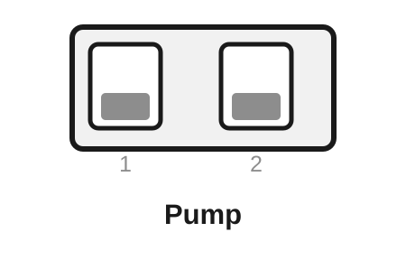
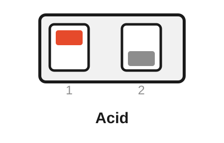
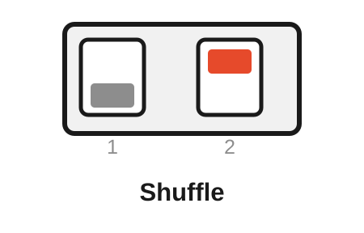
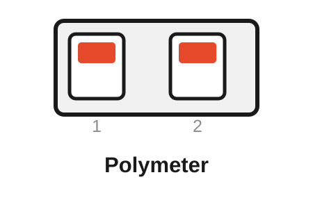
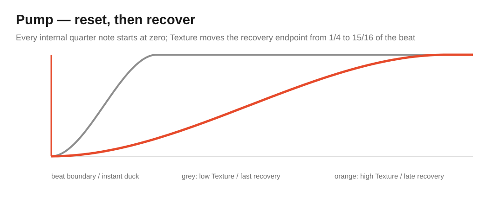
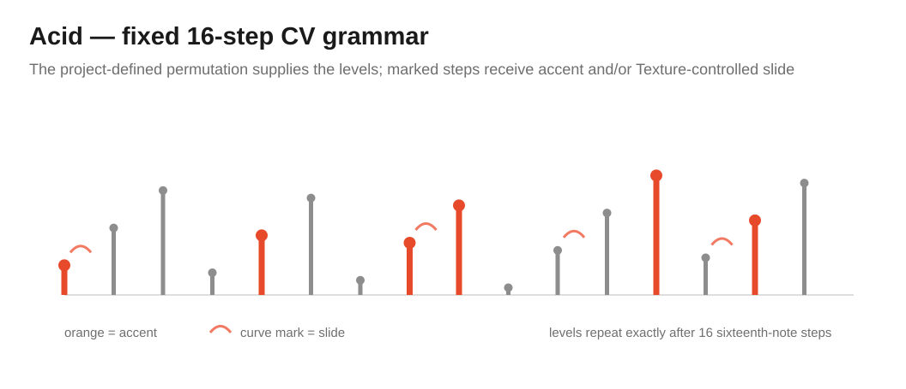
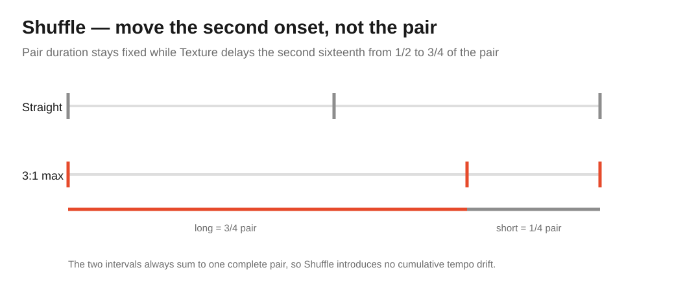
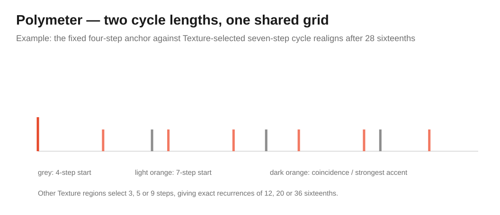

# Free Modular Drift — Electronica Algorithm Bank

[← Main README](README.md) · [Classic bank](README-BANK-CLASSIC.md) · [Organic bank](README-BANK-ORGANIC.md) · [Generative bank](README-BANK-GENERATIVE.md) · [Ambient bank](README-BANK-AMBIENT.md) · [Percussion bank](README-BANK-PERCUSSION.md) · [Dubstep / Bass bank](README-BANK-DUBSTEP.md) · [User manual](docs/manual/README.md) · [Electronica engineering design](docs/analysis/algorithm-banks/electronica-bank-design.md)

The **Electronica bank** is Drift's rhythm-first modulation bank for house, acid, techno and adjacent electronic styles. It contains **Pump, Acid, Shuffle and Polymeter**: four deterministic algorithms built around a musical grid rather than around continuous noise or long stochastic motion.

Electronica does not turn Drift into a sequencer and does not synthesize drums. It produces rhythmic **CV contours and accent structures** that can animate VCAs, filters, waveshapers, effect sends, oscillators and other voltage-controlled destinations.

> [!NOTE]
> Electronica is included in release `0.2.0`. On the original hardware it is deliberately **free-running**: Speed and Speed CV set an internal tempo, but there is no external transport or reset input for this bank.

## Contents

- [Selecting the Electronica bank](#selecting-the-electronica-bank)
- [Rear DIP mapping](#rear-dip-mapping)
- [Controls at a glance](#controls-at-a-glance)
- [Pump — sidechain-style duck and recovery](#pump--sidechain-style-duck-and-recovery)
- [Acid — deterministic accent and slide grammar](#acid--deterministic-accent-and-slide-grammar)
- [Shuffle — straight-to-swing timing deformation](#shuffle--straight-to-swing-timing-deformation)
- [Polymeter — four against odd-length cycles](#polymeter--four-against-odd-length-cycles)
- [Tempo and synchronization constraints](#tempo-and-synchronization-constraints)
- [Build and verification](#build-and-verification)

## Selecting the Electronica bank

Electronica is selected at compile time. The dedicated Arduino Nano environments are:

```bash
pio run -e nanoatmega328new_electronica
pio run -e nanoatmega328_electronica
```

After flashing the Electronica image, the rear DIP switches select Pump, Acid, Shuffle or Polymeter at startup.

The bank uses its own tempo mapping:

$$
B(u)=30\cdot2^{3u}\ \text{BPM},
\qquad 0\le u\le1,
$$

covering **30–240 BPM** over the saturated Speed knob + Speed CV control.

> [!IMPORTANT]
> Electronica's BPM value is an **internal scheduler reference**, not transport lock. The original Drift hardware provides no dedicated clock or reset input for this bank.

> [!IMPORTANT]
> **Attenuation remains analogue and post-DAC.** It changes only the final modulation depth; the firmware cannot read its position.

## Rear DIP mapping

The rear switches are sampled only during startup. **ON is the upper position.** Power-cycle Drift after changing either switch.

<table>
<tr>
<td align="center" width="25%"><br><strong>Pump</strong><br>DIP 1: OFF<br>DIP 2: OFF</td>
<td align="center" width="25%"><br><strong>Acid</strong><br>DIP 1: ON<br>DIP 2: OFF</td>
<td align="center" width="25%"><br><strong>Shuffle</strong><br>DIP 1: OFF<br>DIP 2: ON</td>
<td align="center" width="25%"><br><strong>Polymeter</strong><br>DIP 1: ON<br>DIP 2: ON</td>
</tr>
</table>

| Rear DIP 1 | Rear DIP 2 | Algorithm | Character |
|---|---|---|---|
| **OFF** | **OFF** | **Pump** | Quarter-note duck/recovery contour |
| **ON** | **OFF** | **Acid** | Deterministic 16-step level, accent and slide contour |
| **OFF** | **ON** | **Shuffle** | Straight-to-3:1 long/short timing deformation |
| **ON** | **ON** | **Polymeter** | Four-step anchor against 3/5/7/9-step secondary cycles |

## Controls at a glance

| Mode | Speed | Texture | Texture CV | Attenuation |
|---|---|---|---|---|
| **Pump** | Internal quarter-note tempo | Recovery endpoint from 1/4 to 15/16 beat | Adds recovery length | Final output depth |
| **Acid** | Internal 16th-note grid | Accent and slide intensity | Adds accent/slide intensity | Final output depth |
| **Shuffle** | Internal pair tempo | Straight to 3:1 long/short timing | Adds shuffle amount | Final output depth |
| **Polymeter** | Internal 16th-note grid | Secondary meter 3/5/7/9 | Selects secondary meter | Final output depth |

## Pump — sidechain-style duck and recovery

Pump creates the **shape** associated with rhythmic ducking without pretending that Drift contains a sidechain detector or compressor. Every internal quarter note resets the output contour to zero; the signal then recovers smoothly toward full level.

<p align="center">
  
</p>

Texture maps the recovery endpoint from exactly

$$
\frac{1}{4}\ \text{beat}\quad\text{to}\quad\frac{15}{16}\ \text{beat}.
$$

The recovery itself uses cubic smoothstep, producing zero slope at both ends of the transition. A Q28 reciprocal is cached when the control changes so the real-time path does not require a general phase/end-point division on every sample.

- **Speed** — internal quarter-note tempo.
- **Texture** — how much of the beat is used for recovery.
- **Texture CV** — external recovery-length modulation.
- **Attenuation** — final modulation depth.

Musically, Pump is immediately useful for VCA amplitude, filter cutoff, reverb sends and spectral depth in four-to-the-floor material. It creates a sidechain-style gesture; it does **not** detect an external kick.

Developer detail: [Pump engineering analysis](docs/analysis/algorithms/pump-analysis.md).

## Acid — deterministic accent and slide grammar

Acid produces a fixed 16-step modulation phrase whose structure is generated mathematically rather than stored as a copied musical pattern. The base level order uses

$$
q_n=(5n+3)\bmod16
$$

and

$$
y_n=1024+128q_n.
$$

<p align="center">
  
</p>

Accents occur where

$$
n\bmod4=0\quad\text{or}\quad n\bmod7=0,
$$

while slide positions satisfy

$$
(5n\bmod16)<4.
$$

Texture jointly increases accent contribution and the amount of interpolation used on slide steps. The algorithm uses no random state, so a given control setting is exactly repeatable after reset.

- **Speed** — internal 16th-note grid tempo.
- **Texture** — accent strength and slide interpolation.
- **Texture CV** — external accent/slide modulation.
- **Attenuation** — final modulation depth.

This is deliberately an **acid-inspired CV grammar**, not a TB-303 emulator, note sequencer or copied 303 pattern. Its purpose is to produce a familiar kind of animated electronic contour for cutoff, resonance-adjacent modulation, FM depth or waveshaping.

Developer detail: [Acid engineering analysis](docs/analysis/algorithms/acid-analysis.md).

## Shuffle — straight-to-swing timing deformation

Shuffle changes **when** alternating subdivisions occur while keeping the total duration of every two-step pair constant. It contains no random humanization and therefore remains fully deterministic.

<p align="center">
  
</p>

Let $s$ be the normalized Texture amount. The second onset moves from the center of the pair toward three quarters of the pair. At the endpoint the two intervals are therefore

$$
\frac{3}{4}:\frac{1}{4}=3:1.
$$

Because the complete pair length never changes, increasing Shuffle does not create cumulative tempo drift. Texture is latched at each pair boundary so a live control movement cannot generate a double onset or omit the second onset in an already active pair.

Each onset launches the same short smooth decay; the decay occupies one eighth of the complete pair and remains shorter than the minimum possible second interval.

- **Speed** — internal pair tempo.
- **Texture** — straight-to-3:1 timing deformation.
- **Texture CV** — external shuffle modulation.
- **Attenuation** — final modulation depth.

Musically, Shuffle is useful anywhere a rigid straight grid should become more elastic without becoming random: hats, filter pulses, rhythmic wavetable movement or VCA accents.

Developer detail: [Shuffle engineering analysis](docs/analysis/algorithms/shuffle-analysis.md).

## Polymeter — four against odd-length cycles

Polymeter overlays a fixed four-step primary meter with a Texture-selected secondary cycle of **3, 5, 7 or 9 steps**. Both use the same subdivision duration, so the algorithm is genuinely polymetric rather than a pair of differently clocked subdivisions.

<p align="center">
  
</p>

The exact composite recurrence lengths are the least common multiples

$$
\mathrm{lcm}(4,3)=12,
$$

$$
\mathrm{lcm}(4,5)=20,
$$

$$
\mathrm{lcm}(4,7)=28,
$$

and

$$
\mathrm{lcm}(4,9)=36
$$

sixteenth-note steps.

Each subdivision launches a short decay whose peak encodes the event class: base `1024`, primary `2559`, secondary `2560`, or coincidence `4095`. Meter changes are applied only at the next primary boundary, where the new secondary cycle is also restarted.

- **Speed** — internal 16th-note grid tempo.
- **Texture** — discrete secondary meter selection: 3, 5, 7 or 9.
- **Texture CV** — contributes to that meter selector.
- **Attenuation** — final modulation depth.

Musically, Polymeter creates long deterministic accent cycles from very little state. It is especially effective in techno and sequenced electronic patches where a stable four-step reference should interact with a slower-moving pattern of coincidences.

Developer detail: [Polymeter engineering analysis](docs/analysis/algorithms/polymeter-analysis.md).

## Tempo and synchronization constraints

Electronica uses the original Drift CV input architecture unchanged:

1. Speed CV and Speed knob are combined into the internal 30–240 BPM mapping.
2. Texture CV and Texture knob control the mode-specific secondary parameter.
3. the 12-bit MCP4922 produces the unipolar modulation signal.
4. analogue Attenuation scales that signal after the DAC.

There is **no external clock or reset semantic in Electronica**. This is an intentional distinction from the Percussion bank, where Speed CV is explicitly repurposed as a 0–5 V quarter-note clock input.

The Electronica implementation is deterministic for fixed controls and uses fixed-point arithmetic and fixed-size state. No heap allocation or floating-point arithmetic is required in the AVR hot path. The same flash, SRAM and 2.5 kHz timing policies apply as to every other bank.

## Named developer target

For on-device testing, this bank can be flashed normally with rear-DIP selection or locked to one algorithm by name. For example:

```bash
# Complete Electronica bank: rear DIP switches remain active.
pio run -e nanoatmega328new_electronica -t upload

# Named developer target: DIP switches are ignored.
FMD_FORCE_ALGORITHM=pump pio run -e nanoatmega328new_electronica -t upload
```

The cross-platform helper `python scripts/flash_drift.py algorithm pump` infers this bank automatically. Named targets are developer/test builds only; tagged releases always contain the complete four-algorithm bank.

## Build and verification

Firmware:

```bash
pio run -e nanoatmega328new_electronica
pio run -e nanoatmega328_electronica
```

Native verification:

```bash
pio test -e native_electronica
pio test -e native_electronica_sanitized
pio test -e native_electronica_coverage
```

Timing qualification uses `nanoatmega328new_electronica_timing`. Tagged releases publish Electronica images for both Nano bootloaders; see the [main README](README.md#release-artifacts) for artifact naming.

The bank-level architecture, duplication audit and musical assessment are documented in [Electronica algorithm bank design](docs/analysis/algorithm-banks/electronica-bank-design.md).

<!-- drift-footer:start -->
<p align="center">
  From Munich with 
</p>
<!-- drift-footer:end -->
