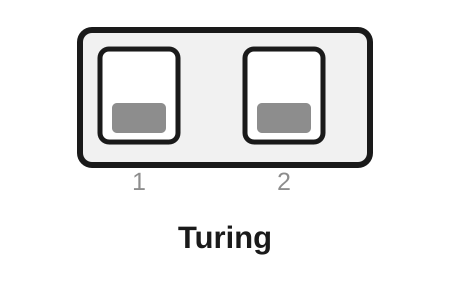
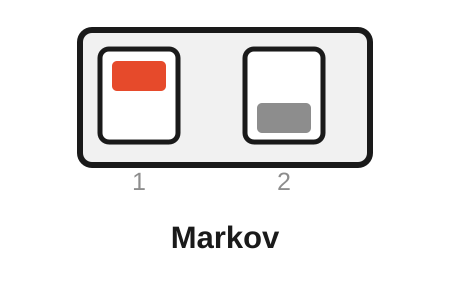
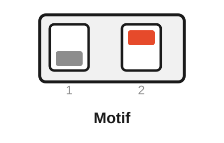
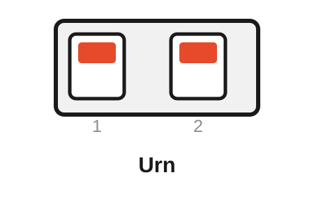
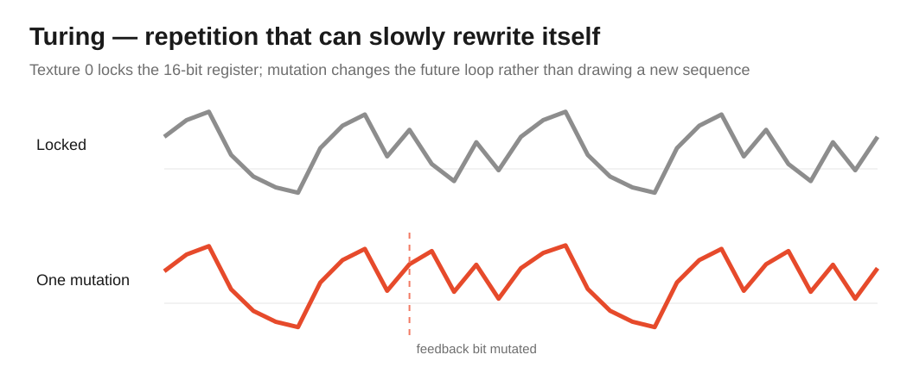
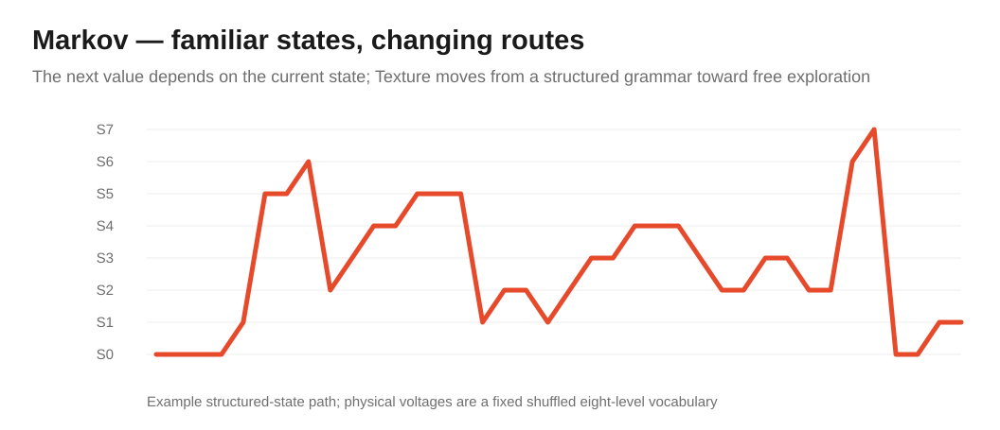
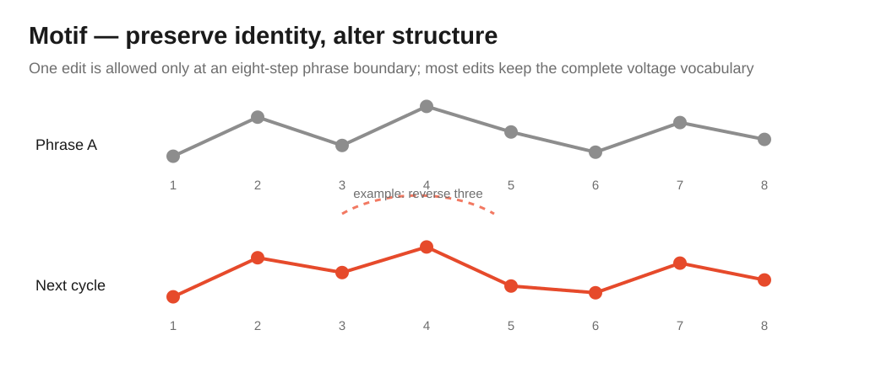
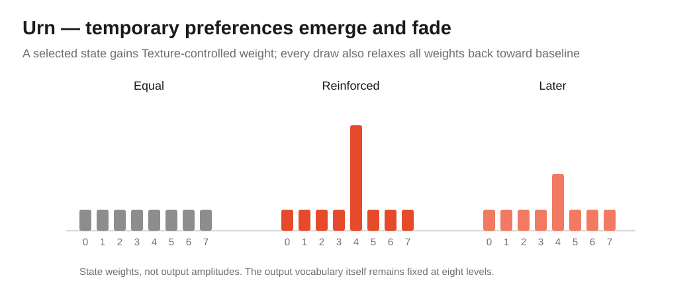

# Free Modular Drift — Generative Algorithm Bank

[← Main README](README.md) · [Classic bank](README-BANK-CLASSIC.md) · [Organic bank](README-BANK-ORGANIC.md) · [Ambient bank](README-BANK-AMBIENT.md) · [Electronica bank](README-BANK-ELECTRONICA.md) · [Percussion bank](README-BANK-PERCUSSION.md) · [User manual](docs/manual/README.md) · [Generative engineering design](docs/analysis/algorithm-banks/generative-bank-design.md)

The **Generative bank** turns Drift into a memory-driven stepped-modulation source. It contains **Turing, Markov, Motif and Urn**: four algorithms whose future output depends on retained loop, state, phrase or reinforcement history rather than on a continuously evolving trajectory.

Where Classic and Organic are largely about *motion*, Generative is about *behaviour over time*: repetition that mutates, familiar states reached by changing routes, phrases altered structurally rather than redrawn, and statistical preferences that can emerge and fade.

> [!NOTE]
> Generative is included in release `0.2.0`. It uses the original Drift hardware unchanged and is selected by flashing a dedicated Generative firmware image.

## Contents

- [Selecting the Generative bank](#selecting-the-generative-bank)
- [Rear DIP mapping](#rear-dip-mapping)
- [Controls at a glance](#controls-at-a-glance)
- [Turing — evolving shift-register loop](#turing--evolving-shift-register-loop)
- [Markov — recurring vocabulary, changing route](#markov--recurring-vocabulary-changing-route)
- [Motif — phrase identity through structural variation](#motif--phrase-identity-through-structural-variation)
- [Urn — temporary statistical preferences](#urn--temporary-statistical-preferences)
- [Hardware and implementation constraints](#hardware-and-implementation-constraints)
- [Build and verification](#build-and-verification)

## Selecting the Generative bank

Generative is selected at compile time. The dedicated Arduino Nano environments are:

```bash
pio run -e nanoatmega328new_generative
pio run -e nanoatmega328_generative
```

The flashed image contains the Generative bank only. The two rear DIP switches then select Turing, Markov, Motif or Urn at startup.

> [!IMPORTANT]
> **Flashing chooses the bank; the rear DIP chooses the algorithm inside that bank.** Changing the DIP switches cannot move between Classic, Organic, Generative, Ambient, Electronica or Percussion.

All four modes are internally stepped. **Speed** controls the step/draw rate using Drift's shared approximately 1 V/oct exponential mapping; **Speed CV** contributes to that same rate. **Texture** and **Texture CV** control the algorithm-specific evolution mechanism.

> [!IMPORTANT]
> **Attenuation is analogue.** It sits after the DAC and cannot be read by the firmware. It changes final modulation depth only; it never changes mutation, exploration, edit probability or reinforcement internally.

## Rear DIP mapping

The rear switches are sampled only during startup. **ON is the upper position.** Power-cycle Drift after changing either switch.

<table>
<tr>
<td align="center" width="25%"><br><strong>Turing</strong><br>DIP 1: OFF<br>DIP 2: OFF</td>
<td align="center" width="25%"><br><strong>Markov</strong><br>DIP 1: ON<br>DIP 2: OFF</td>
<td align="center" width="25%"><br><strong>Motif</strong><br>DIP 1: OFF<br>DIP 2: ON</td>
<td align="center" width="25%"><br><strong>Urn</strong><br>DIP 1: ON<br>DIP 2: ON</td>
</tr>
</table>

| Rear DIP 1 | Rear DIP 2 | Algorithm | Character |
|---|---|---|---|
| **OFF** | **OFF** | **Turing** | Repeating 16-bit loop that gradually rewrites itself |
| **ON** | **OFF** | **Markov** | Eight-state vocabulary with changing transition routes |
| **OFF** | **ON** | **Motif** | Eight-step phrase changed by sparse structural edits |
| **ON** | **ON** | **Urn** | Reinforced state preferences that emerge and decay |

## Controls at a glance

| Mode | Speed | Texture | Texture CV | Attenuation |
|---|---|---|---|---|
| **Turing** | Shift rate | Mutation probability from exact lock to 50% | Adds mutation | Final output depth |
| **Markov** | State-transition rate | Exploration from fixed grammar to uniform choice | Adds exploration | Final output depth |
| **Motif** | Phrase step rate | Probability of one structural edit per completed phrase | Adds edit probability | Final output depth |
| **Urn** | Draw rate | Reinforcement strength | Adds reinforcement | Final output depth |

## Turing — evolving shift-register loop

Turing is the most directly repetitive member of the bank. A 16-bit shift register continuously recycles its own feedback bit; Texture controls whether that recycled bit is retained or probabilistically inverted.

<p align="center">
  
</p>

If $p$ is the mutation probability,

$$
b_{new}=b_{feedback}\oplus B(p),
\qquad 0\le p\le\frac{1}{2}.
$$

At Texture zero, $p=0$ and the register rotates exactly. A non-degenerate state therefore produces a locked 16-step voltage loop. At maximum Texture, $p=1/2$ and the incoming bit is maximally independent of the recycled bit.

Mapping Texture to $p=1$ would **not** produce more randomness: every feedback bit would simply invert deterministically. The 50% endpoint is therefore a mathematical requirement rather than an arbitrary panel choice.

The upper twelve register bits are used directly as the DAC value:

$$
y=R\gg4.
$$

- **Speed** — shift rate of the 16-bit loop.
- **Texture** — probability that the recycled feedback bit mutates.
- **Texture CV** — external mutation control.
- **Attenuation** — final modulation depth.

Musically, Turing is strongest when a patch should develop a recognisable stepped motif rather than generate unrelated random voltages. Low Texture can hold a sequence for a long time; increasing Texture lets the identity drift by small mutations instead of replacing it wholesale.

Developer detail: [Turing engineering analysis](docs/analysis/algorithms/turing-analysis.md).

## Markov — recurring vocabulary, changing route

Markov separates **which voltages exist** from **how the algorithm travels among them**. It uses eight symbolic states and a fixed seed-derived voltage vocabulary. Texture changes the transition law, not the vocabulary itself.

<p align="center">
  
</p>

At minimum Texture, state $i$ follows the structured grammar:

- $1/2$ stay at $i$;
- $1/4$ move to $(i+1)\bmod8$;
- $1/8$ move to $(i-1)\bmod8$;
- $1/8$ move to $(i+4)\bmod8$.

Texture mixes that grammar with uniform exploration:

$$
P_{\tau}=(1-\tau)P_s+\tau U.
$$

At full Texture the next state is selected uniformly from all eight states. The voltage vocabulary remains fixed, which is why the output can retain a recognizable tonal or timbral set of destinations even when the path becomes highly exploratory.

- **Speed** — transition rate between symbolic states.
- **Texture** — amount of exploration away from the structured transition grammar.
- **Texture CV** — external exploration control.
- **Attenuation** — final modulation depth.

Musically, Markov is useful where repetition should be statistical rather than literal: the same places keep returning, but not in a fixed sequence. It works especially well for stepped timbre, filter, waveshaper or pitch-adjacent modulation where a recurring vocabulary is more useful than a repeating phrase.

Developer detail: [Markov engineering analysis](docs/analysis/algorithms/markov-analysis.md).

## Motif — phrase identity through structural variation

Motif stores an explicit eight-step phrase of 12-bit values. It plays the complete phrase and, only at the cycle boundary, may apply **one** structural edit. Texture therefore controls the rate at which a musical object evolves, not the randomness of every individual step.

<p align="center">
  
</p>

The edit probability per completed phrase is

$$
P(edit)=\tau.
$$

When an edit occurs, one of four equally likely transformations is selected:

1. rotate the phrase one step left or right;
2. swap one adjacent circular pair;
3. reverse one circular three-step span;
4. replace one value with a new 12-bit value.

Three of the four operations preserve the complete eight-value vocabulary. Even replacement changes only one value. At maximum Texture the algorithm still performs **at most one edit per complete phrase**.

The edit is applied before step 0 of the new cycle is emitted, so an audible phrase is never half old and half new.

- **Speed** — step rate of the eight-step phrase.
- **Texture** — probability that the next phrase receives one structural edit.
- **Texture CV** — external edit-probability control.
- **Attenuation** — final modulation depth.

Musically, Motif is the strongest **identity-through-variation** mode in Drift. It can keep a phrase recognisable over many repetitions while changing its order, local contour or occasional value in controlled increments.

Developer detail: [Motif engineering analysis](docs/analysis/algorithms/motif-analysis.md).

## Urn — temporary statistical preferences

Urn is the least sequence-like member of Generative. It uses eight fixed output states whose selection weights reinforce recent choices and then slowly relax back toward a common baseline.

<p align="center">
  
</p>

All states start at baseline weight $b=32$. Before each draw, each weight relaxes toward baseline by a factor of $31/32$:

$$
w_i'=b+\left\lfloor\frac{31(w_i-b)}{32}\right\rfloor.
$$

The next state is then drawn proportionally to the current weights,

$$
P(X=i)=\frac{w_i}{\sum_j w_j},
$$

and the selected state receives Texture-controlled reinforcement from 0 to 64, bounded at $w_{max}=1023$.

The fixed eight-state voltage vocabulary is

$$
v_i=585i,
\qquad i=0\ldots7,
$$

which spans the complete 0…4095 DAC range.

This is deliberately a **bounded, leaky, Pólya-inspired process**, not an exact classical Pólya urn. The leak is musically important: an early random preference can become dominant for a while, but it cannot own the process forever.

- **Speed** — rate at which states are drawn.
- **Texture** — reinforcement added to the selected state.
- **Texture CV** — external reinforcement control.
- **Attenuation** — final modulation depth.

Musically, Urn produces habits rather than patterns. A patch can linger statistically around certain voltage regions, gradually develop new favourites and later abandon them without an explicit sequence ever being stored.

Developer detail: [Urn engineering analysis](docs/analysis/algorithms/urn-analysis.md).

## Hardware and implementation constraints

Generative uses the original Drift signal path unchanged:

1. Speed CV — A4
2. Texture CV — A5
3. Speed knob — ADC6/A6
4. Texture knob — ADC7/A7
5. 12-bit MCP4922 Channel-A output
6. analogue Attenuation after the DAC
7. output-level LED derived from the generated DAC value

The bank uses fixed-size state only: one 16-bit register for Turing, eight-state data for Markov and Urn, and an eight-value phrase for Motif. There is no heap allocation in the AVR path. Randomized modes use the firmware's deterministic seeded pseudo-random infrastructure so host tests can reproduce exact state evolution.

The same repository guardrails apply as for every bank: application flash at or below 85%, static SRAM at or below 65%, strict native builds, sanitizer coverage and dedicated timing qualification against the 2.5 kHz processing deadline.

## Build and verification

Firmware:

```bash
pio run -e nanoatmega328new_generative
pio run -e nanoatmega328_generative
```

Native verification:

```bash
pio test -e native_generative
pio test -e native_generative_sanitized
pio test -e native_generative_coverage
```

Timing qualification uses `nanoatmega328new_generative_timing`. Tagged releases publish Generative images for both Nano bootloaders; see the [main README](README.md#release-artifacts) for artifact naming.

The bank-level architecture, duplication audit and musical assessment are documented in [Generative algorithm bank design](docs/analysis/algorithm-banks/generative-bank-design.md).

<!-- drift-footer:start -->
<p align="center">
  From Munich with 
</p>
<!-- drift-footer:end -->
