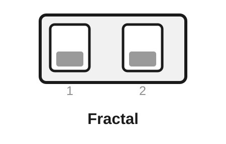
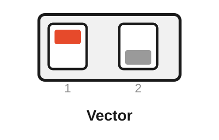
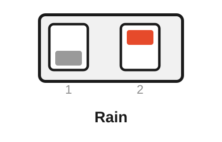
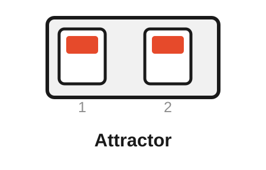

# Free Modular Drift — Organic Algorithm Bank

[← Main README](README.md) · [Classic bank](README-BANK-CLASSIC.md) · [Generative bank](README-BANK-GENERATIVE.md) · [Ambient bank](README-BANK-AMBIENT.md) · [Electronica bank](README-BANK-ELECTRONICA.md) · [Percussion bank](README-BANK-PERCUSSION.md) · [User manual](docs/manual/README.md) · [Organic engineering design](docs/analysis/algorithm-banks/organic-bank-design.md)

The **Organic bank** is Drift's motion-design bank. It contains **Fractal, Vector, Rain and Attractor**: four deliberately different ways of creating movement without turning the module into a conventional sequencer or a collection of cosmetic variations on Classic.

Fractal works across several correlated time scales. Vector follows a deterministic path through a coupled two-dimensional field. Rain treats modulation as stochastic events whose tails overlap. Attractor derives motion from a nonlinear dynamical system. What ties them together is not a shared equation but a shared musical goal: **continuous or event-like CV whose internal structure changes as Texture is moved, while the familiar Drift panel remains intact**.

> [!NOTE]
> Organic is included in release `0.2.0`. It uses the original Drift hardware unchanged and is selected by flashing the dedicated Organic firmware image. Classic remains the compatibility/default bank when no alternative bank is selected at compile time.

## Contents

- [Selecting the Organic bank](#selecting-the-organic-bank)
- [What makes the Organic bank different](#what-makes-the-organic-bank-different)
- [Rear DIP mapping](#rear-dip-mapping)
- [Controls at a glance](#controls-at-a-glance)
- [Fractal — correlated motion across three scales](#fractal--correlated-motion-across-three-scales)
- [Vector — deterministic coupled flow](#vector--deterministic-coupled-flow)
- [Rain — stochastic impulses with controllable density](#rain--stochastic-impulses-with-controllable-density)
- [Attractor — nonlinear motion from the Hénon map](#attractor--nonlinear-motion-from-the-hénon-map)
- [Hardware and real-time design](#hardware-and-real-time-design)
- [Build and verification](#build-and-verification)

## Selecting the Organic bank

Organic is selected at compile time. The dedicated Arduino Nano environments are:

```bash
pio run -e nanoatmega328new_organic
pio run -e nanoatmega328_organic
```

The flashed image contains the Organic bank only. The two rear DIP switches then select **Fractal, Vector, Rain or Attractor** at startup.

> [!IMPORTANT]
> **Flashing chooses the bank; the rear DIP chooses the algorithm inside that bank.** Changing either DIP switch cannot move between Classic, Organic, Generative, Ambient, Electronica or Percussion. The switches are sampled at startup, so power-cycle Drift after changing them.

Organic keeps the normal Drift control model. **Speed** and **Speed CV** control the primary time scale. **Texture** and **Texture CV** change the structural parameter particular to each algorithm. The front-panel **Attenuation** control remains an analogue post-DAC level control and cannot be read by the firmware.

## What makes the Organic bank different

Organic deliberately spans four different process families rather than four variants of one noise generator:

| Algorithm | Process | Random? | Output character | Particularly useful for |
|---|---|---:|---|---|
| **Fractal** | Three-scale correlated gradient field | Seeded / pseudo-random field | Continuous, layered, roughness-controllable | Filter/timbre motion, stereo position, effect depth, macro-CV with surface detail |
| **Vector** | Coupled two-dimensional toroidal flow | No | Continuous, directed, self-rephasing | Wavetable position, FM depth, panning, parameters that benefit from coherent motion without obvious repetition |
| **Rain** | Bernoulli event arrivals into one leaky envelope | Yes | Event-like, unipolar, sparse-to-dense | Irregular accents, modulation bursts, texture density, percussive or granular-style control gestures |
| **Attractor** | Hénon nonlinear map with interpolated travel | No | Structured nonlinear motion, sometimes irregular and sometimes windowed | Resonance, folding, timbre, feedback or any destination that reacts interestingly to changing orbit structure |

This separation matters musically. **Fractal** is about detail distributed across scale. **Vector** is about deterministic direction through a coupled state space. **Rain** is about event density. **Attractor** is about nonlinear structure. Texture therefore has a different musical meaning in every slot, but in all four cases it changes **behaviour**, not simply output level.

The bank also avoids three misleading simplifications:

- Fractal is **procedural multi-scale gradient noise**, not a claim of exact fractional Brownian motion.
- Rain is a **discrete Bernoulli event process**, not an exact continuous-time Poisson process.
- Attractor Texture is a **structure parameter**, not a monotonic “chaos amount”.

Those distinctions are part of the firmware contract and are covered in the engineering analyses.

## Rear DIP mapping

**ON is the upper switch position.** Power-cycle the module after changing either rear switch.

<table>
<tr>
<td align="center" width="25%"><br><strong>Fractal</strong><br>DIP 1: OFF<br>DIP 2: OFF</td>
<td align="center" width="25%"><br><strong>Vector</strong><br>DIP 1: ON<br>DIP 2: OFF</td>
<td align="center" width="25%"><br><strong>Rain</strong><br>DIP 1: OFF<br>DIP 2: ON</td>
<td align="center" width="25%"><br><strong>Attractor</strong><br>DIP 1: ON<br>DIP 2: ON</td>
</tr>
</table>

| Rear DIP 1 | Rear DIP 2 | Algorithm | Character |
|---|---|---|---|
| **OFF** | **OFF** | **Fractal** | Correlated motion at 1×, 4× and 16× scales |
| **ON** | **OFF** | **Vector** | Deterministic coupled flow through a two-dimensional torus |
| **OFF** | **ON** | **Rain** | Random positive impulses with Texture-controlled density and overlapping decay |
| **ON** | **ON** | **Attractor** | Interpolated motion through a fixed-point Hénon-map orbit |

## Controls at a glance

| Mode | Speed | Speed CV | Texture | Texture CV | Attenuation |
|---|---|---|---|---|---|
| **Fractal** | Traversal speed through all three scales | Adds to traversal rate | Roughness / redistribution toward fine scales | Adds roughness | Final modulation depth |
| **Vector** | Base flow speed | Adds to flow rate | Cross-axis coupling | Adds coupling | Final modulation depth |
| **Rain** | Tail-decay speed | Adds to decay rate | **Density** | Adds Density | Final analogue **Intensity** |
| **Attractor** | Travel rate between map points | Adds to travel rate | Hénon structure parameter $a$ | Adds to $a$ | Final modulation depth |

> [!IMPORTANT]
> **Attenuation is analogue and post-DAC.** The ATmega328P cannot read its position. In Rain it is musically natural to call the result *Intensity*, but it still scales only the final voltage; it never changes event probability, decay or any other internal state.

## Fractal — correlated motion across three scales

Fractal extends Drift's verified one-dimensional gradient-noise primitive into three simultaneous time scales. It keeps the broad movement that makes Perlin musically useful, but lets Texture place progressively more energy into faster correlated detail.

<p align="center">
  
</p>

The three layers run at relative rates 1×, 4× and 16×:

$$
F(t)=w_0(T)n(t)+w_1(T)n(4t)+w_2(T)n(16t).
$$

The implementation keeps a constant total integer weight:

$$
w_0+w_1+w_2=1024,
$$

with endpoint weights

$$
(1024,0,0)\rightarrow(512,320,192).
$$

Because the sum remains constant, Texture primarily changes **where the movement lives in scale**, not nominal amplitude. Even at full Texture the macro layer still carries half of the total weight; the algorithm never degenerates into only high-frequency detail.

- **Speed** — traversal rate shared by the three gradient layers.
- **Texture** — redistribution from broad motion toward 4× and 16× detail.
- **Texture CV** — external roughness/detail modulation.
- **Attenuation** — final modulation depth.

**Musically**, Fractal is the Organic choice when one CV should carry both a slow contour and smaller movement riding on top of it. Low Texture works well for broad timbral or spatial drift; higher Texture adds surface activity without losing the underlying direction. The result is especially effective on destinations that reward motion at more than one time scale, such as filter cutoff plus resonance interaction, wavetable position, FM index, panning or effect depth.

**Implementation note.** Fractal is expected to be the most computationally expensive Organic mode because it evaluates three gradient-noise layers per processing sample. That cost is intentional and is qualified by the dedicated Organic timing build rather than inferred from source inspection.

Developer detail: [Fractal engineering analysis](docs/analysis/algorithms/fractal-analysis.md).

## Vector — deterministic coupled flow

Vector is the deterministic counterweight to Fractal. It maintains two phase coordinates on a torus and lets each axis perturb the speed of the other through a bipolar triangle projection. No random-number generator is involved.

<p align="center">
  
</p>

In continuous-form notation the intended field is

$$
\dot{\phi}_x=\omega+\kappa T(\phi_y),
$$

$$
\dot{\phi}_y=\frac{3}{4}\omega-\kappa T(\phi_x).
$$

The second base rate is three quarters of the first. Texture controls the coupling term $\kappa$. In the fixed-point implementation full-scale coupling is bounded to roughly **±25%** of each axis's base increment, so increasing Texture bends the trajectory without making either phase reverse solely because of the coupling.

The visible output is the average projection of the two bipolar phase coordinates, remapped into the 12-bit unipolar DAC domain.

- **Speed** — common base rate of the two-dimensional flow.
- **Texture** — cross-axis coupling strength.
- **Texture CV** — external coupling modulation.
- **Attenuation** — final modulation depth.

**Musically**, Vector is useful when randomness is not required but a plain LFO is too predictable. At low Texture the two phases move with related but independent timing; as coupling rises, each axis continually changes the other's instantaneous motion. This gives coherent movement with direction and memory, but without the obvious single-cycle identity of a conventional oscillator.

Because the process is deterministic for fixed controls and initial state, Vector is particularly useful when repeatability matters in a patch even though the resulting trajectory does not sound like a simple repeating waveform.

Developer detail: [Vector engineering analysis](docs/analysis/algorithms/vector-analysis.md).

## Rain — stochastic impulses with controllable density

Rain treats modulation as **events** rather than as a continuously evolving trajectory. Texture becomes **Density**: sparse settings produce isolated drops, while denser settings make more event tails overlap until the output approaches a continuously active stochastic texture.

<p align="center">
  
</p>

Once per 2.5 kHz processing sample, a uniform 16-bit random word $r$ is compared with a Texture-derived cutoff

$$
C(d)=\left\lfloor\frac{d^2}{64}\right\rfloor,
\qquad 0\le d\le1023.
$$

An event occurs when

$$
r<C(d).
$$

The quadratic mapping deliberately devotes more panel travel to sparse-event control than a linear full-range probability law would.

Each event adds a positive random impulse to one aggregate envelope. Between events the state decays approximately as

$$
E_{n+1}=E_n-\alpha E_n.
$$

A retained fractional residual prevents low-level tails from becoming stuck simply because one integer decay step would otherwise round to zero. Impulse accumulation saturates rather than wrapping.

- **Speed** — drop-tail decay speed.
- **Texture** — event **Density**.
- **Texture CV** — external Density modulation.
- **Attenuation** — final analogue output **Intensity**.

**Musically**, Rain is strongest when CV should arrive as irregular activity rather than constant wandering: accents into a filter or wavefolder, sporadic modulation of effect depth, bursts of FM, or event-like movement around a mostly stable patch. The Density law makes the sparse end deliberately playable; the high end allows overlapping events to create a denser stochastic wash.

Rain is a **discrete Bernoulli event process with a shared leaky envelope**. It is shot-noise-inspired, but it does not claim to be an exact continuous-time Poisson process or to simulate independent physical droplets.

Developer detail: [Rain engineering analysis](docs/analysis/algorithms/rain-analysis.md).

## Attractor — nonlinear motion from the Hénon map

Attractor uses Michel Hénon's two-dimensional map as its state generator:

$$
x_{n+1}=1-a x_n^2+y_n,
$$

$$
y_{n+1}=b x_n.
$$

Drift fixes

$$
b=0.30
$$

and maps Texture over

$$
1.20\le a\le1.40.
$$

<p align="center">
  
</p>

The nonlinear map advances discretely, but the output does **not** jump directly from one Hénon point to the next. During each Speed cycle Drift linearly travels from the previous $x$ coordinate to the new $x$ coordinate. That interpolation turns a mathematically discrete map into a usable continuous CV trajectory.

- **Speed** — travel/interpolation rate between successive map points.
- **Texture** — Hénon structure parameter $a$.
- **Texture CV** — external control of $a$ within the validated range.
- **Attenuation** — final modulation depth.

**Musically**, Attractor is useful when a patch benefits from movement that feels structured but does not behave like random noise or a conventional oscillator. Sweeping Texture can move the orbit through qualitatively different regions, including periodic windows and more irregular structures. That makes the mode effective for sensitive nonlinear destinations such as resonance, feedback, folding, FM depth or timbre controls where small changes in trajectory create audible changes in behaviour.

> [!IMPORTANT]
> Texture is **not** a monotonic “chaos amount”. The Hénon family does not become simply more chaotic as $a$ increases. The control is therefore documented as **Structure**.

**Implementation note.** State is held in signed fixed point; the Hénon iteration runs only when an interpolation segment rolls over. The per-sample path therefore performs the inexpensive travel interpolation rather than recomputing the nonlinear map at 2.5 kHz.

Developer detail: [Attractor engineering analysis](docs/analysis/algorithms/attractor-analysis.md).

## Hardware and real-time design

Organic uses the original Drift signal path unchanged:

1. Speed CV — A4
2. Texture CV — A5
3. Speed knob — ADC6/A6
4. Texture knob — ADC7/A7
5. 12-bit MCP4922 Channel-A output
6. analogue Attenuation after the DAC
7. output-level LED derived from the generated DAC value

The bank is designed around ATmega328P constraints rather than desktop DSP assumptions:

- no heap allocation in the real-time path;
- no floating-point arithmetic in the AVR hot path;
- 12-bit DAC bounds are an invariant of every algorithm;
- stochastic modes are deterministic for a fixed pseudo-random seed;
- Fractal reuses the verified Classic gradient primitive;
- Vector keeps coupling in bounded integer arithmetic;
- Rain normally needs one PRNG draw per sample and a second only when an event occurs;
- Attractor moves nonlinear iteration out of the per-sample hot path and interpolates between map points;
- application flash must remain at or below **85%** of the ATmega328P limit;
- static SRAM must remain at or below **65%**;
- the processing deadline is qualified against Drift's **2.5 kHz** runtime cadence.

The bank-level architecture, duplication audit and musical rationale are documented in [Organic algorithm bank design](docs/analysis/algorithm-banks/organic-bank-design.md).

## Named developer target

For on-device testing, this bank can be flashed normally with rear-DIP selection or locked to one algorithm by name. For example:

```bash
# Complete Organic bank: rear DIP switches remain active.
pio run -e nanoatmega328new_organic -t upload

# Named developer target: DIP switches are ignored.
FMD_FORCE_ALGORITHM=fractal pio run -e nanoatmega328new_organic -t upload
```

The cross-platform helper `python scripts/flash_drift.py algorithm fractal` infers this bank automatically. Named targets are developer/test builds only; tagged releases always contain the complete four-algorithm bank.

## Build and verification

Firmware builds:

```bash
pio run -e nanoatmega328new_organic
pio run -e nanoatmega328_organic
```

Native verification:

```bash
pio test -e native_organic
pio test -e native_organic_sanitized
pio test -e native_organic_coverage
```

Timing qualification uses:

```bash
pio run -e nanoatmega328new_organic_timing
```

Organic has dedicated mathematical suites for Fractal, Vector, Rain and Attractor plus the common bank-aware selection, runtime, property and system paths. Coverage for bank-owned Organic production sources is subject to the extended-bank release policy: **97% line / 90% branch aggregate**, with a **95% line / 80% branch per-file floor** so a well-covered helper cannot hide a weak algorithm implementation. See [README_TESTING.md](README_TESTING.md) for the complete verification contract and current measured baselines.

Tagged releases publish Organic HEX/ELF images for both supported Nano bootloaders, together with per-image BUILD-INFO provenance, the firmware manifest and checksums; see [Release artifacts](README.md#release-artifacts).

<!-- drift-footer:start -->
<p align="center">
  From Munich with 
</p>
<!-- drift-footer:end -->
