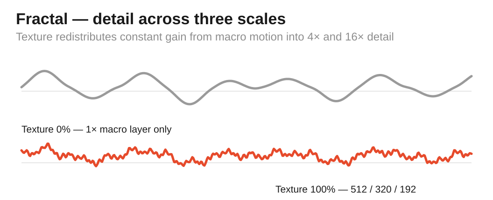
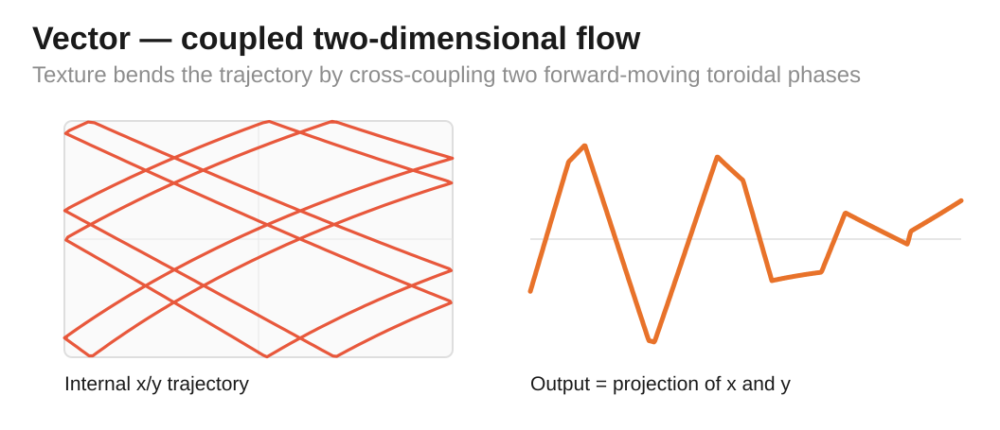
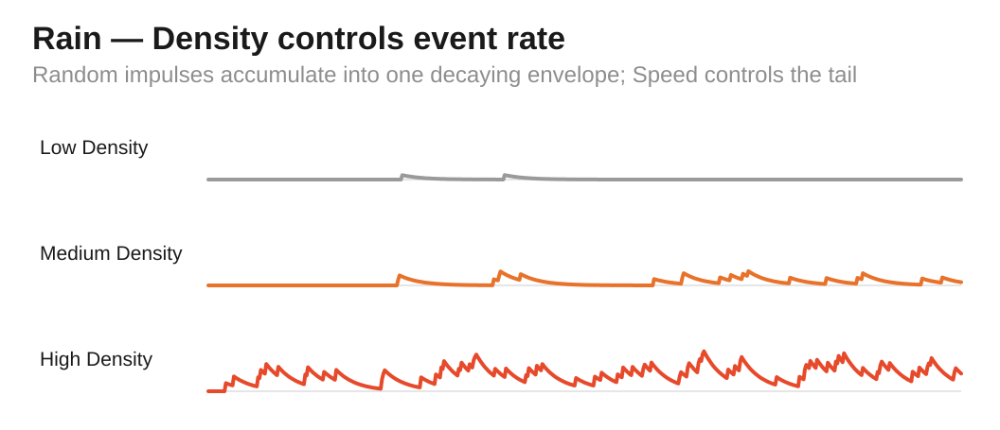
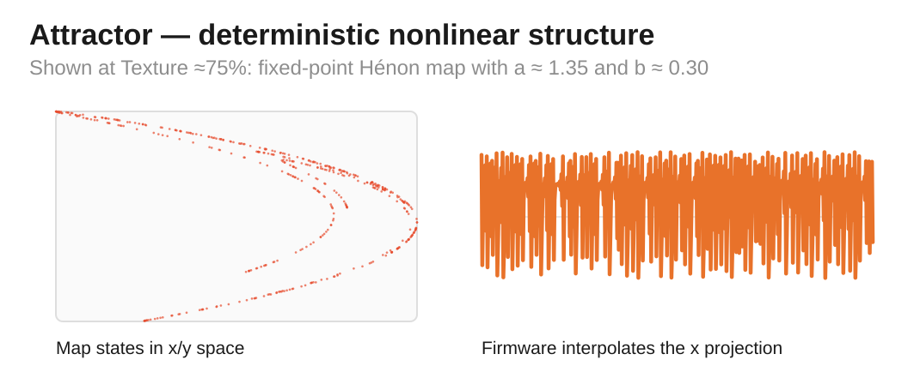

# Free Modular Drift — Organic Algorithm Bank

[← Main README](README.md) · [Classic bank](README-BANK-CLASSIC.md) · [Generative bank](README-BANK-GENERATIVE.md) · [Ambient bank](README-BANK-AMBIENT.md) · [User manual](docs/manual/README.md) · [Organic engineering design](docs/analysis/algorithm-banks/organic-bank-design.md) · [Percussion bank](README-BANK-PERCUSSION.md)

The **Organic bank** is the first compile-time alternative bank for Drift. It keeps the original hardware and the same two rear DIP switches, but fills the four slots with **Fractal, Vector, Rain and Attractor**. The bank explores multi-scale correlated noise, deterministic two-dimensional flow, stochastic event density and nonlinear dynamical motion.

> [!NOTE]
> Organic is currently part of `Unreleased` development. It does not replace or modify the Classic 0.1.0 compatibility bank.

## Contents

- [Selecting the Organic bank](#selecting-the-organic-bank)
- [Rear DIP mapping](#rear-dip-mapping)
- [Controls at a glance](#controls-at-a-glance)
- [Fractal — multi-scale correlated motion](#fractal--multi-scale-correlated-motion)
- [Vector — coupled two-dimensional flow](#vector--coupled-two-dimensional-flow)
- [Rain — density-controlled stochastic impulses](#rain--density-controlled-stochastic-impulses)
- [Attractor — deterministic nonlinear motion](#attractor--deterministic-nonlinear-motion)
- [Hardware and implementation constraints](#hardware-and-implementation-constraints)
- [Build and verification](#build-and-verification)

## Selecting the Organic bank

Organic is selected at compile time. The dedicated PlatformIO environments are:

```bash
pio run -e nanoatmega328new_organic
pio run -e nanoatmega328_organic
```

The firmware image contains only the selected bank. After Organic has been flashed, the rear DIP switches choose Fractal, Vector, Rain or Attractor at startup.

<p align="center">
  
</p>

> [!IMPORTANT]
> **Flashing chooses the bank; the rear DIP chooses the algorithm inside that bank.** A DIP change can never switch from Classic to Organic or back.

## Rear DIP mapping

The physical truth table is the same as Classic. **ON is the upper switch position**, and changes are sampled only during startup.

| Rear DIP 1 | Rear DIP 2 | Algorithm | Character |
|---|---|---|---|
| **OFF** | **OFF** | **Fractal** | Correlated gradient noise across three time scales |
| **ON** | **OFF** | **Vector** | Deterministic motion through a coupled two-dimensional toroidal field |
| **OFF** | **ON** | **Rain** | Density-controlled random impulses with overlapping decay |
| **ON** | **ON** | **Attractor** | Deterministic nonlinear motion based on a fixed-point Hénon map |

## Controls at a glance

| Mode | Speed | Texture | Texture CV | Attenuation |
|---|---|---|---|---|
| **Fractal** | Traversal speed | Roughness / fine-scale weight | Adds roughness | Modulation depth |
| **Vector** | Flow speed | Cross-axis coupling | Adds coupling | Modulation depth |
| **Rain** | Drop-tail decay speed | **Density** | Adds density | **Output intensity** |
| **Attractor** | Travel rate between map points | Hénon structure parameter $a$ | Adds to $a$ control | Modulation depth |

Speed CV contributes to Speed in all four Organic modes. Texture CV contributes to the same secondary parameter as the Texture knob.

> [!IMPORTANT]
> **Attenuation is analogue.** The ATmega328P cannot read its position. The descriptions *Depth* and *Intensity* therefore refer to the physical scaling of the final DAC signal, not to an internal algorithm parameter.

## Fractal — multi-scale correlated motion

Fractal extends Drift's gradient-noise idea into three simultaneous time scales. The layers run at relative rates 1×, 4× and 16×:

$$
F(t)=w_0(T)n(t)+w_1(T)n(4t)+w_2(T)n(16t)
$$

with a constant total weight

$$
w_0+w_1+w_2=1.
$$

Texture redistributes gain from the macro layer toward the faster layers. In the integer implementation the endpoint weights move from

$$
(1024,0,0)\rightarrow(512,320,192).
$$

Because the total gain remains fixed, Texture primarily changes **scale content and roughness**, not nominal amplitude. Large-scale motion remains present even at maximum Texture.

<p align="center">
  
</p>

- **Speed** — traversal rate through all three layers.
- **Texture** — amount of medium- and fine-scale detail.
- **Texture CV** — external roughness modulation.
- **Attenuation** — final modulation depth.

The mode is deliberately described as **procedural fractal noise** rather than exact fractional Brownian motion; it uses an fBm-like multi-scale construction without claiming the full stochastic definition of fractional Brownian motion.

Developer detail: [Fractal engineering analysis](docs/analysis/algorithms/fractal-analysis.md).

## Vector — coupled two-dimensional flow

Vector maintains two phase coordinates on a torus. Each axis advances continuously, and Texture introduces bounded state-dependent coupling from the other axis:

$$
\dot{\phi}_x=\omega+\kappa T(\phi_y)
$$

$$
\dot{\phi}_y=\frac{3}{4}\omega-\kappa T(\phi_x).
$$

The scalar output is a projection of the two bipolar triangle coordinates back into the 12-bit unipolar DAC range. Full-scale coupling is bounded so the cross-axis term perturbs motion without forcing either axis to reverse solely because Texture is increased.

<p align="center">
  
</p>

- **Speed** — base flow rate through the two-dimensional state space.
- **Texture** — cross-axis coupling strength.
- **Texture CV** — external coupling modulation.
- **Attenuation** — final modulation depth.

At low Texture the two phase motions are largely independent; increasing Texture bends each axis according to the current state of the other. The result is deterministic rather than pseudo-random.

Developer detail: [Vector engineering analysis](docs/analysis/algorithms/vector-analysis.md).

## Rain — density-controlled stochastic impulses

Rain is a discrete-time, shot-noise-inspired event process. Texture is explicitly **Density**. Once per 2.5 kHz processing sample, a uniform 16-bit random word is compared with the Texture-derived event cutoff

$$
C(d)=\left\lfloor\frac{d^2}{64}\right\rfloor,
\qquad 0\le d\le1023.
$$

An event occurs when

$$
r<C(d).
$$

The quadratic mapping deliberately gives more panel resolution to sparse events than a linear probability mapping would.

Each event adds a positive random impulse to one aggregate envelope. Between events the envelope decays approximately as

$$
E_{n+1}=E_n-\alpha E_n.
$$

A fractional residual is retained so low-level tails cannot freeze merely because an integer decay step falls below one code.

<p align="center">
  
</p>

- **Speed** — decay speed / drop-tail time scale.
- **Texture** — event **Density**.
- **Texture CV** — externally modulated Density.
- **Attenuation** — final analogue **Intensity**.

At sparse settings the output contains isolated events; increasing Density causes more tails to overlap until the result becomes much more continuously active. The implementation is a discrete Bernoulli event process, not a claim of an exact continuous-time Poisson process.

Developer detail: [Rain engineering analysis](docs/analysis/algorithms/rain-analysis.md).

## Attractor — deterministic nonlinear motion

Attractor uses Michel Hénon's two-dimensional map:

$$
x_{n+1}=1-a x_n^2+y_n
$$

$$
y_{n+1}=b x_n.
$$

Drift fixes

$$
b=0.30
$$

and maps Texture over

$$
1.20\le a\le1.40.
$$

The map itself advances discretely, but the emitted CV linearly travels from the previous $x$ coordinate to the next $x$ coordinate during each Speed cycle. This avoids turning the algorithm into a simple sample-and-hold staircase.

<p align="center">
  
</p>

- **Speed** — interpolation/travel rate between successive map points.
- **Texture** — the Hénon **structure parameter** $a$.
- **Texture CV** — adds to the $a$ control.
- **Attenuation** — final modulation depth.

Texture must not be interpreted as a monotonic "chaos amount". Nonlinear parameter sweeps can contain periodic windows and qualitatively different structures. The practical control is therefore **structure**, not simply more-or-less chaos.

Developer detail: [Attractor engineering analysis](docs/analysis/algorithms/attractor-analysis.md).

## Hardware and implementation constraints

The Organic bank obeys the same physical signal path as Classic:

1. Speed CV — A4
2. Texture CV — A5
3. Speed knob — ADC6/A6
4. Texture knob — ADC7/A7
5. 12-bit MCP4922 Channel-A output
6. analogue Attenuation after the DAC
7. output-level LED derived from the generated DAC value

The bank is implemented without heap allocation or floating-point arithmetic in the AVR hot path. The repository applies the same firmware guardrails to every bank: application flash at or below 85%, static SRAM at or below 65%, and dedicated timing qualification against the 2.5 kHz processing deadline.

## Build and verification

Firmware:

```bash
pio run -e nanoatmega328new_organic
pio run -e nanoatmega328_organic
```

Native verification:

```bash
pio test -e native_organic
pio test -e native_organic_sanitized
pio test -e native_organic_coverage
```

Timing qualification uses `nanoatmega328new_organic_timing`. Tagged releases publish Organic images for both Nano bootloaders alongside Classic; see the [main README](README.md#release-artifacts) for artifact naming.

The bank-level contract is documented in [Organic algorithm bank design](docs/analysis/algorithm-banks/organic-bank-design.md).

<!-- drift-footer:start -->
<p align="center">
  From Munich with 
</p>
<!-- drift-footer:end -->
