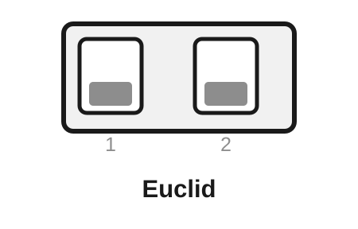
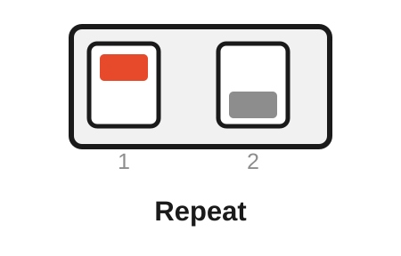
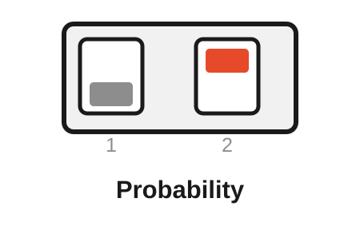
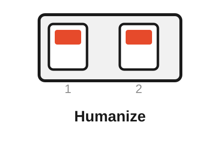
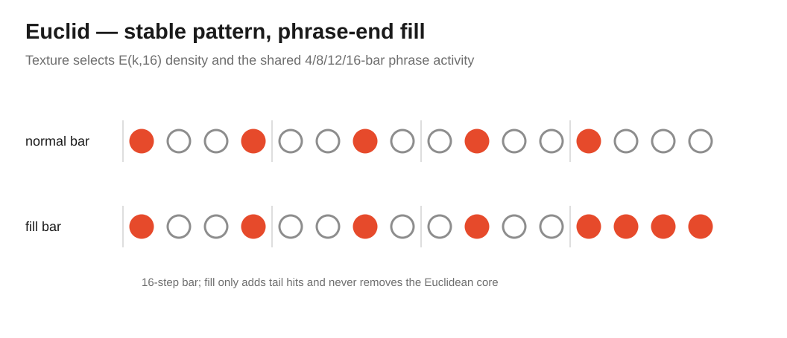
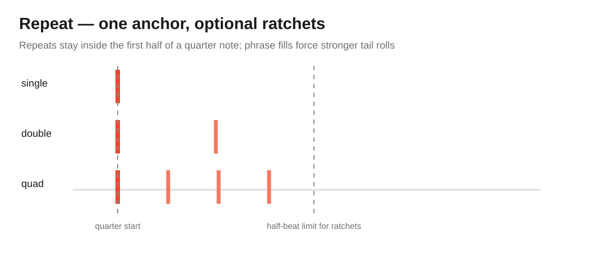
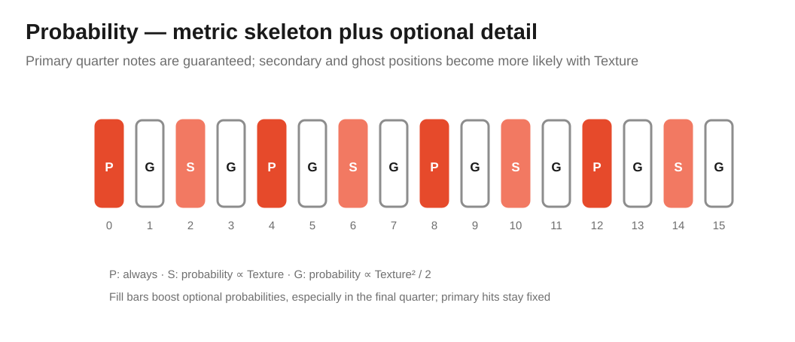
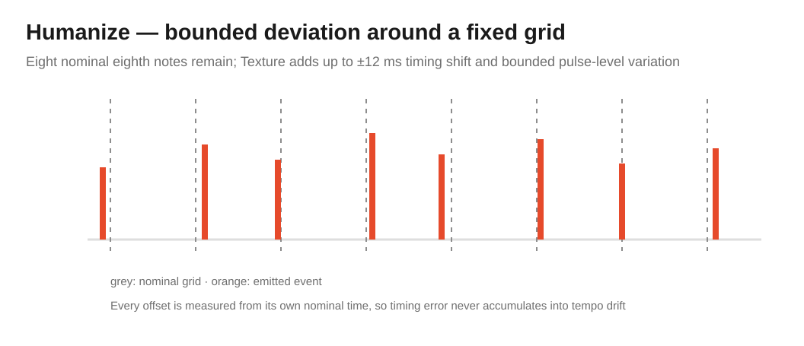

# Free Modular Drift — Percussion Algorithm Bank

[← Main README](README.md) · [Classic bank](README-BANK-CLASSIC.md) · [Organic bank](README-BANK-ORGANIC.md) · [Generative bank](README-BANK-GENERATIVE.md) · [Ambient bank](README-BANK-AMBIENT.md) · [Electronica bank](README-BANK-ELECTRONICA.md) · [Dubstep / Bass bank](README-BANK-DUBSTEP.md) · [User manual](docs/manual/README.md) · [Percussion engineering design](docs/analysis/algorithm-banks/percussion-bank-design.md)

The **Percussion bank** turns Drift into a one-output rhythm and trigger/CV generator. It contains **Euclid, Repeat, Probability and Humanize**. Rather than pretending that the hardware can become a four-track drum sequencer, each algorithm addresses a different layer of rhythmic structure: hit placement, sub-hit repetition, optional event probability or timing/level feel.

Percussion can run completely standalone from the **Speed knob at 30–240 BPM**, or it can repurpose **Speed CV as an optional external quarter-note clock input**. Euclid, Repeat and Probability also share a 4/8/12/16-bar phrase model so the bank can create fills and longer-form structure rather than endlessly repeating one bar.

> [!NOTE]
> Percussion is included in release `0.2.0`. In this bank only, Speed CV changes meaning from analogue tempo modulation to an optional digital clock source.

> [!WARNING]
> **Original-hardware clock input limit: 0–5 V only. Do not patch 10 V Eurorack triggers or clocks into Speed CV.** The current Drift input stage was designed as a 0–5 V CV input and is not protected or specified as a general 10 V trigger input. Firmware cannot add overvoltage protection to the existing analogue hardware.

## Contents

- [Selecting the Percussion bank](#selecting-the-percussion-bank)
- [Rear DIP mapping](#rear-dip-mapping)
- [Controls at a glance](#controls-at-a-glance)
- [Clock source and fallback](#clock-source-and-fallback)
- [Shared phrase engine](#shared-phrase-engine)
- [Euclid — distributed rhythm with phrase-end fills](#euclid--distributed-rhythm-with-phrase-end-fills)
- [Repeat — ratchets, flams and tail rolls](#repeat--ratchets-flams-and-tail-rolls)
- [Probability — metric skeleton with weighted variation](#probability--metric-skeleton-with-weighted-variation)
- [Humanize — bounded timing and level variation](#humanize--bounded-timing-and-level-variation)
- [Hardware and implementation constraints](#hardware-and-implementation-constraints)
- [Build and verification](#build-and-verification)

## Selecting the Percussion bank

Percussion is selected at compile time. The dedicated Arduino Nano environments are:

```bash
pio run -e nanoatmega328new_percussion
pio run -e nanoatmega328_percussion
```

After flashing the Percussion image, the rear DIP switches select Euclid, Repeat, Probability or Humanize at startup.

With no external clock detected, the **Speed knob** controls the internal 30–240 BPM clock. Once a valid external clock is acquired on Speed CV, the measured external period becomes the timing source instead. Texture and Texture CV retain their normal role as the algorithm-specific macro control.

> [!IMPORTANT]
> **Attenuation remains analogue.** It scales the final output after the DAC and does not affect hit probability, fill logic, ratchet count, timing jitter or phrase length inside the firmware.

## Rear DIP mapping

The rear switches are sampled only at startup. **ON is the upper position.** Power-cycle Drift after changing either switch.

<table>
<tr>
<td align="center" width="25%"><br><strong>Euclid</strong><br>DIP 1: OFF<br>DIP 2: OFF</td>
<td align="center" width="25%"><br><strong>Repeat</strong><br>DIP 1: ON<br>DIP 2: OFF</td>
<td align="center" width="25%"><br><strong>Probability</strong><br>DIP 1: OFF<br>DIP 2: ON</td>
<td align="center" width="25%"><br><strong>Humanize</strong><br>DIP 1: ON<br>DIP 2: ON</td>
</tr>
</table>

| Rear DIP 1 | Rear DIP 2 | Algorithm | Character |
|---|---|---|---|
| **OFF** | **OFF** | **Euclid** | Evenly distributed 16-step rhythm with deterministic phrase fills |
| **ON** | **OFF** | **Repeat** | Quarter-note anchors with stochastic ratchets and fill rolls |
| **OFF** | **ON** | **Probability** | Stable metric skeleton with weighted stochastic additions |
| **ON** | **ON** | **Humanize** | Fixed eighth-note grid with bounded timing and level variation |

## Controls at a glance

| Mode | Speed | Speed CV | Texture / Texture CV | Attenuation |
|---|---|---|---|---|
| **Euclid** | Internal tempo when unsynced | Optional 0–5 V quarter-note clock | Hit density plus phrase/fill activity | Final output depth |
| **Repeat** | Internal tempo when unsynced | Optional 0–5 V quarter-note clock | Repeat probability, ratchet depth and phrase activity | Final output depth |
| **Probability** | Internal tempo when unsynced | Optional 0–5 V quarter-note clock | Secondary/ghost probability plus phrase activity | Final output depth |
| **Humanize** | Internal tempo when unsynced | Optional 0–5 V quarter-note clock | Microtiming and pulse-level variation | Final output depth |

## Clock source and fallback

Percussion is the only bank in `0.2.0` that gives Speed CV a dedicated **clock** meaning.

Internally, the clock detector uses hysteresis at approximately **1 V LOW / 2 V HIGH**. A rising edge is accepted only after the signal has previously returned below the LOW threshold. This prevents noise around one threshold from generating repeated edges.

Two valid rising edges are required before external timing takes over because the firmware needs one complete interval to measure the quarter-note period. Each accepted edge represents one quarter note; sixteenth/eighth subdivisions and Repeat ratchets are derived from that measured period.

On acquisition, the second accepted edge becomes a deterministic phrase origin: **bar 1, beat 1**. The hardware has no separate reset input, so there is no external bar-position information to recover.

If the external clock then disappears for more than **2.5 measured periods**, timing automatically falls back to the current Speed-knob tempo. Existing bar and phrase counters continue through that fallback rather than resetting. A later reacquisition establishes a new deterministic phrase origin.

> [!WARNING]
> The clock detector's software thresholds do **not** make the input electrically tolerant of higher trigger voltages. On the original hardware, use **0–5 V only**.

## Shared phrase engine

Euclid, Repeat and Probability share a 4/4-oriented phrase layer above their per-step behavior:

```text
sub-event → step → 16-step bar → 4/8/12/16-bar phrase → fill bar
```

Texture maps the phrase length to **16, 12, 8 or 4 bars** and also maps a five-level fill strength. Phrase length is latched only at the beginning of a phrase, so moving Texture or Texture CV cannot shift the ending of a phrase that is already underway.

The algorithms interpret the same `isFillBar` state differently:

- **Euclid** adds deterministic tail hits.
- **Repeat** increases ratchet depth near the phrase end.
- **Probability** raises only optional hit probabilities.
- **Humanize** deliberately ignores the fill engine and preserves event count.

This gives the bank hierarchy over several time scales without adding more panel controls.

## Euclid — distributed rhythm with phrase-end fills

Euclid chooses one of the verified canonical `E(k,16)` patterns for $k=2\ldots13$. The complete mask set is generated and verified outside the real-time path; the AVR selects precomputed constants rather than executing Bjorklund generation during playback.

<p align="center">
  
</p>

The base principle is to distribute $k$ onsets as evenly as possible over 16 steps. Texture controls the selected density and the phrase/fill macro behavior.

On the final bar of a phrase, fill strength can add hits only to the final quarter of the bar:

| Fill level | Added tail positions |
|---|---|
| `F0` | none |
| `F1` | 15 |
| `F2` | 14–15 |
| `F3` | 13–15 |
| `F4` | 12–15 |

Existing Euclidean hits are never removed. The fill is therefore a transformation of the current pattern rather than a replacement by unrelated random events.

- **Speed / Speed CV** — internal tempo or external quarter-note clock.
- **Texture** — Euclidean density plus phrase/fill macro position.
- **Texture CV** — external macro modulation.
- **Attenuation** — final pulse/CV depth.

Musically, Euclid is the general-purpose pattern source of the bank: sparse kick-like structures, mid-density percussion and denser hat-like patterns can all come from the same evenly distributed foundation, with phrase-end variation layered on top.

Developer detail: [Euclid engineering analysis](docs/analysis/algorithms/euclid-analysis.md).

## Repeat — ratchets, flams and tail rolls

Repeat separates the **main beat** from the smaller events that can happen inside it. Every quarter note has a guaranteed anchor; Texture controls whether additional pulses appear and how deep their ratchet cluster becomes.

<p align="center">
  
</p>

The ordinary repeat probability rises to a maximum of

$$
p_{repeat}=\frac{3}{4}\tau.
$$

An active cluster contains two, three or four pulses distributed through the **first half of the quarter note**. The main quarter-note grid therefore remains recognizable even when repeats become dense.

Phrase fills force progressively stronger tail behavior. At the maximum fill level, four-pulse clusters occur on both final half-bar beats, producing an unmistakable closing roll before the phrase starts again.

- **Speed / Speed CV** — internal tempo or external quarter-note clock.
- **Texture** — repeat probability, ratchet count and phrase activity.
- **Texture CV** — external repeat/fill modulation.
- **Attenuation** — final pulse/CV depth.

Musically, Repeat is suited to hats, claps, snares, percussion voices and modulation destinations where occasional flams or rolls are more useful than changing the underlying hit locations.

Developer detail: [Repeat engineering analysis](docs/analysis/algorithms/repeat-analysis.md).

## Probability — metric skeleton with weighted variation

Probability starts from a deterministic metric skeleton and adds optional events according to their musical position. It deliberately avoids assigning the same probability to every step.

<p align="center">
  
</p>

The 16-step bar contains three classes:

- **Primary** — steps `0, 4, 8, 12`, always present.
- **Secondary** — steps `2, 6, 10, 14`, probability rises linearly with Texture.
- **Ghost** — odd steps, probability rises quadratically to a maximum of one half.

A compact form of the optional laws is

$$
P_{secondary}=\tau
$$

and

$$
P_{ghost}=\frac{\tau^2}{2}.
$$

The final phrase bar increases only optional probabilities, with additional emphasis near the tail. Primary hits remain deterministic, so a fill adds activity without destroying the metric reference.

- **Speed / Speed CV** — internal tempo or external quarter-note clock.
- **Texture** — optional-hit probability plus phrase activity.
- **Texture CV** — external probability/fill modulation.
- **Attenuation** — final pulse/CV depth.

Musically, Probability works well for ghost snares, hats, auxiliary percussion and any patch where a stable pulse should acquire controlled variation without becoming an undifferentiated random trigger stream.

Developer detail: [Probability engineering analysis](docs/analysis/algorithms/probability-analysis.md).

## Humanize — bounded timing and level variation

Humanize changes neither phrase structure nor event count. It keeps exactly **eight nominal eighth-note events per bar** and moves each event only around its own independent grid position.

<p align="center">
  
</p>

For nominal event time $t_n^0$,

$$
t_n=t_n^0+\delta_n,
$$

where the Texture-controlled timing offset is bounded to approximately

$$
|\delta_n|\le12\ \text{ms}.
$$

Pulse level also receives bounded variation. Crucially, the next event is **not** scheduled from the already-jittered previous event. Every event references the nominal grid independently, so timing error cannot accumulate into random tempo drift.

The scheduler handles negative and positive offsets around the nominal event. Positive delay is counted only after the event's nominal point; this behavior is covered by a dedicated regression test.

- **Speed / Speed CV** — internal tempo or external quarter-note clock.
- **Texture** — microtiming and pulse-level variation.
- **Texture CV** — external humanization amount.
- **Attenuation** — final pulse/CV depth.

Musically, Humanize is aimed at hats, shakers, claves, ghost percussion and other material where a rigid grid benefits from small timing and intensity deviations. It deliberately does not generate fills, extra hits or long-term tempo wander.

Developer detail: [Humanize engineering analysis](docs/analysis/algorithms/humanize-analysis.md).

## Hardware and implementation constraints

Percussion uses the same ATmega328P, ADC path and MCP4922 output as every other bank, but Speed CV has a special bank-local interpretation:

1. **Speed knob** — internal 30–240 BPM clock when no external clock is locked.
2. **Speed CV** — optional 0–5 V quarter-note clock input; not summed as an analogue tempo CV while clocking.
3. **Texture knob + Texture CV** — mode-specific rhythmic macro control.
4. **MCP4922 Channel A** — 12-bit unipolar pulse/CV output.
5. **Attenuation** — final analogue output scaling after the DAC.

The clock is sampled through the existing analogue input path, not a dedicated interrupt or Schmitt-trigger input. The firmware therefore uses ADC hysteresis and period measurement rather than claiming hardware-level trigger conditioning.

> [!WARNING]
> This implementation is a firmware feature on top of an existing **0–5 V CV input**. It is not a substitute for the protected Eurorack clock-input circuitry planned for a future hardware revision.

All phrase, repeat and scheduler state is statically allocated. No heap allocation is required in the AVR hot path. The common flash/SRAM resource policies and 2.5 kHz timing qualification apply to Percussion as well.

## Named developer target

For on-device testing, this bank can be flashed normally with rear-DIP selection or locked to one algorithm by name. For example:

```bash
# Complete Percussion bank: rear DIP switches remain active.
pio run -e nanoatmega328new_percussion -t upload

# Named developer target: DIP switches are ignored.
FMD_FORCE_ALGORITHM=euclid pio run -e nanoatmega328new_percussion -t upload
```

The cross-platform helper `python scripts/flash_drift.py algorithm euclid` infers this bank automatically. Named targets are developer/test builds only; tagged releases always contain the complete four-algorithm bank.

## Build and verification

Firmware:

```bash
pio run -e nanoatmega328new_percussion
pio run -e nanoatmega328_percussion
```

Native verification:

```bash
pio test -e native_percussion
pio test -e native_percussion_sanitized
pio test -e native_percussion_coverage
```

The dedicated clock-source suite is part of the Percussion CI selection. Timing qualification uses `nanoatmega328new_percussion_timing`. Tagged releases publish Percussion images for both Nano bootloaders; see the [main README](README.md#release-artifacts) for artifact naming.

The bank-level phrase, clock, duplication and musical contracts are documented in [Percussion algorithm bank design](docs/analysis/algorithm-banks/percussion-bank-design.md).

<!-- drift-footer:start -->
<p align="center">
  From Munich with 
</p>
<!-- drift-footer:end -->
