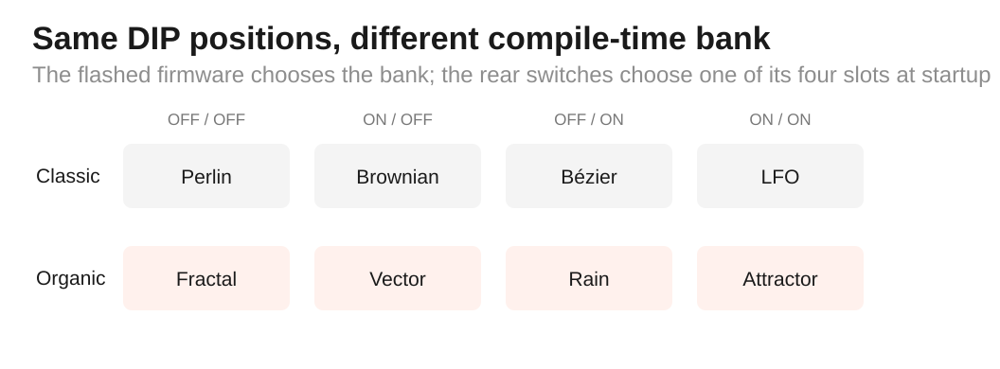
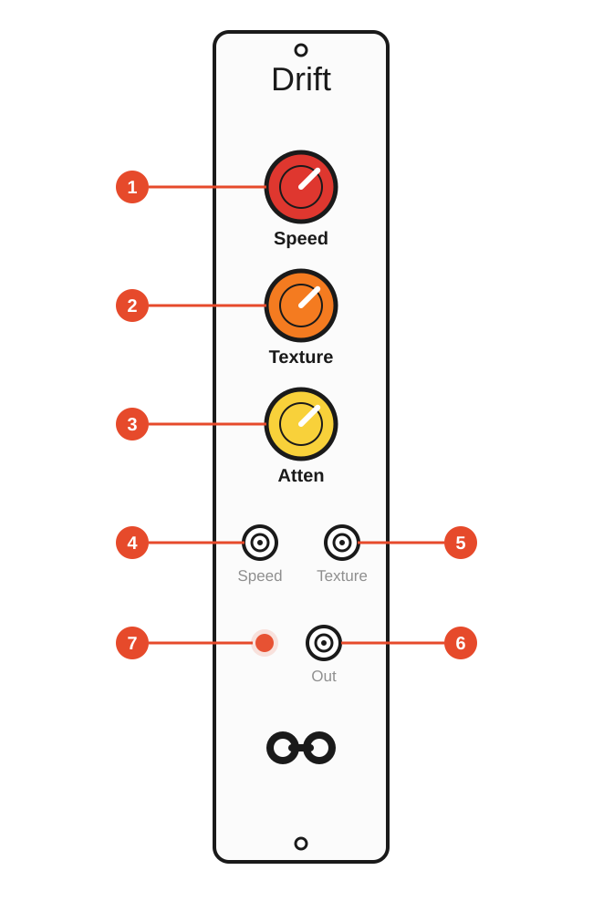

# Free Modular Drift — Alternative C++/PlatformIO Firmware

[](https://github.com/napolitano/eurorack-organic-modulation-firmware/actions/workflows/ci.yml)
[](https://github.com/napolitano/eurorack-organic-modulation-firmware/releases)
[](LICENSE)


> [!NOTE]
> ### With appreciation to Quinn Freedman
> **Drift is Quinn Freedman's instrument.** The original Free Modular hardware, musical concept and Rust firmware are the foundation of this repository. This alternative firmware exists because that work was published openly and is interesting enough to study carefully, preserve and develop further. The goal here is not to erase the upstream implementation, but to keep its identity intact while making the firmware easier to build, test, document and maintain.
>
> - [Free Modular Drift](https://freemodular.org/modules/Drift/)
> - [Quinn Freedman's upstream source](https://github.com/QuinnFreedman/modular/tree/main/modules/Drift)

## What is Drift?

Drift is a **4 HP Eurorack modulation source** that produces evolving 0–10 V control voltages. Its defining idea is controlled movement: instead of choosing only between a conventional repeating LFO and completely uncorrelated random values, Drift offers several ways to generate motion with **continuity, memory, structure or controlled unpredictability**.

This firmware now supports two compile-time algorithm banks:

| Bank | Algorithms | Status | Detailed guide |
|---|---|---|---|
| **Classic** | Perlin · Brownian · Bézier · LFO | Default; 0.1.0 compatibility baseline | **[README-CLASSIC.md](README-CLASSIC.md)** |
| **Organic** | Fractal · Vector · Rain · Attractor | Optional compile-time bank; currently `Unreleased` | **[README-ORGANIC.md](README-ORGANIC.md)** |

<p align="center">
  
</p>

> [!IMPORTANT]
> **Flashing chooses the algorithm bank.** The two rear DIP switches then choose one of four algorithms inside the flashed bank. A DIP setting cannot switch between Classic and Organic.

## Why this firmware?

The upstream firmware already contains a thoughtful fixed-point implementation of the Drift concept. This project rebuilds it as a **C++17/PlatformIO best-practice firmware** for the original Arduino Nano / ATmega328P hardware, with a different emphasis: behavior should be understandable, mathematically defensible and demonstrably correct.

The project therefore aims to:

- preserve the recognisable Drift instrument and the four original algorithm concepts as the default Classic bank;
- allow compile-time alternative banks to explore new modulation models without changing the original hardware or reserving runtime resources in Classic builds;
- separate portable signal-processing code from Arduino/AVR hardware access;
- verify each algorithm against its mathematical definition, not merely against historical output bytes;
- retain upstream behavior where it represents intentional musical design;
- correct verified numerical, continuity or state-handling problems transparently;
- qualify resource use and real-time behavior on the ATmega328P;
- provide reproducible builds, automated tests, release notes and a versioned PDF user manual.

> [!IMPORTANT]
> **Release 0.1.0 is the first official release.** Tag [`v0.1.0`](https://github.com/napolitano/eurorack-organic-modulation-firmware/releases/tag/v0.1.0) establishes the Classic C++17/PlatformIO baseline. New work after this tag belongs under `Unreleased` in the changelog.

## Quick start

### 1. Know the front panel

<p align="center">
  
</p>

| Ref. | Panel element | What it does |
|---:|---|---|
| **1** | **Speed** | Primary time-scale or activity control. Its exact meaning depends on the selected algorithm. |
| **2** | **Texture** | Secondary shape, structure or activity control. Its exact meaning depends on the selected algorithm. |
| **3** | **Attenuation** | Analogue scaling of the final 0–10 V output; firmware cannot read this knob. |
| **4** | **Speed CV** | 0–5 V control input contributing to Speed. |
| **5** | **Texture CV** | 0–5 V control input contributing to the algorithm's secondary parameter. |
| **6** | **Output** | Unipolar 0–10 V modulation output. |
| **7** | **LED** | Indicates instantaneous output level. |

### 2. Choose the bank, then the DIP slot

The bank is fixed when the firmware is compiled/flashed. The rear DIP truth table is then interpreted inside that bank:

| Rear DIP 1 | Rear DIP 2 | Classic | Organic |
|---|---|---|---|
| **OFF** | **OFF** | Perlin | Fractal |
| **ON** | **OFF** | Brownian | Vector |
| **OFF** | **ON** | Bézier | Rain |
| **ON** | **ON** | LFO | Attractor |

The switches are sampled only during startup. Cycle power after changing them. **ON is the upper physical switch position.**

For mode-specific control semantics, mathematics, figures and use cases, use the bank guides:

- **[Classic bank — Perlin, Brownian, Bézier, LFO](README-CLASSIC.md)**
- **[Organic bank — Fractal, Vector, Rain, Attractor](README-ORGANIC.md)**

### 3. Make the first patch

1. Flash the desired bank and set the rear DIP switches for the algorithm you want.
2. Power the rack normally.
3. Patch **OUT** to a modulation destination such as filter cutoff, wavetable position, waveshaping, effect depth, panning or another CV-controlled parameter.
4. Turn **Attenuation** fully clockwise while learning the mode, then reduce it if the destination needs a smaller modulation range.
5. Start with **Speed** and **Texture** near the middle and explore their behavior using the selected bank guide.
6. Patch 0–5 V modulation into **Speed CV** or **Texture CV** when you want Drift's behavior to evolve under external control.

> [!TIP]
> Drift outputs **0–10 V unipolar CV**. If the destination expects a smaller or bipolar range, use the Attenuation knob and, where necessary, an external attenuverter/offset stage.

## Contents

- [What is Drift?](#what-is-drift)
- [Why this firmware?](#why-this-firmware)
- [Quick start](#quick-start)
- [Algorithm-bank guides](#algorithm-bank-guides)
- [Release history](#release-history)
- [Engineering architecture](#engineering-architecture)
- [Code documentation](#code-documentation)
- [Verification and tests](#verification-and-tests)
- [Algorithm engineering analyses](#algorithm-engineering-analyses)
- [Build](#build)
- [Release artifacts](#release-artifacts)
- [User manual](#user-manual)
- [Release process](#release-process)
- [Upstream and licence](#upstream-and-licence)

## Algorithm-bank guides

The detailed user-facing algorithm documentation now lives at repository root so each bank can evolve without turning this main README into a manual of eight unrelated control models.

| Guide | Includes |
|---|---|
| **[README-CLASSIC.md](README-CLASSIC.md)** | DIP mapping, controls, Perlin/Brownian/Bézier/LFO mathematics and figures, upstream findings, Classic build commands |
| **[README-ORGANIC.md](README-ORGANIC.md)** | DIP mapping, controls, Fractal/Vector/Rain/Attractor mathematics and figures, hardware constraints, Organic build commands |

The maintained [PDF user manual source](docs/manual/README.md) remains the complete end-user reference. The engineering derivations stay under [docs/analysis](docs/analysis/algorithms/README.md).

## Release history

| Version | Summary |
|---|---|
| **0.1.0** | Initial C++17/PlatformIO firmware release for Free Modular Drift: four mathematically tested modulation algorithms, documented corrections to verified upstream issues, comprehensive Doxygen/source documentation, native/AVR CI, resource guardrails, engineering analyses, hardened release/manual tooling and a tagged-release PDF user manual. |

The authoritative detailed history is the [changelog](CHANGELOG.md). Version `0.1.0` is published from tag [`v0.1.0`](https://github.com/napolitano/eurorack-organic-modulation-firmware/releases/tag/v0.1.0). Future releases follow the same rule: ordinary commits and pull requests never create a GitHub Release; only a pushed version tag does.

## Engineering architecture

```text
Arduino entry points
        |
FirmwareController              src/platform/nano_atmega328p/
        |
   DriftRuntime                 lib/fmd/application/
        |
    DriftEngine                 lib/fmd/domain/
        |
 compile-time bank
   /    |    |    \
 four selected algorithms
        |
minimal ports                   lib/fmd/ports/
        |
AVR ADC / DAC / LED / tables    src/platform/nano_atmega328p/
```

The portable core never calls `analogRead()`, `digitalWrite()`, `SPI.transfer()`, AVR registers or Arduino timing functions. Hardware dependencies terminate at small ports implemented by the Nano/ATmega328P platform layer.

### Engineering goals

- keep `src/main.cpp` as a minimal composition entry point;
- keep portable production code independent of Arduino/AVR APIs;
- execute the real production core in host-side tests rather than duplicating the algorithms in a test model;
- keep mathematical helper functions production-facing so they can be verified directly;
- maintain strict compiler warnings, sanitizer runs, coverage and requirement-traceability gates;
- measure AVR timing and resource costs before accepting performance-sensitive optimisations.

## Code documentation

Production C++ follows the same documentation discipline used by the Quantizer project: every source file carries a complete provenance/licence header, public and non-obvious APIs use Doxygen contracts, fixed-point units and ranges are stated explicitly, and complex numerical or AVR-specific implementation choices are explained inline. Names favour domain intent over terse implementation shorthand.

The conventions and local Doxygen workflow are documented in [docs/development/code-documentation.md](docs/development/code-documentation.md). CI also runs `scripts/check_code_documentation.py` so file headers, generated-table provenance and readability constraints cannot silently regress.

## Verification and tests

The test strategy distinguishes **mathematical correctness**, **state-machine behavior**, **regression protection**, **system behavior** and **hardware qualification**.

Current native coverage includes:

- dedicated mathematical suites for all four Classic algorithms and all four Organic algorithms;
- shared fixed-point, frequency, RNG and reference-table tests;
- edge-case and long-run state-transition tests;
- property/invariant tests across the control domain;
- regression tests for corrected upstream findings;
- integration and end-to-end runtime tests using the real production core;
- machine-checked acceptance-criteria traceability;
- sanitizer and coverage environments.

The released 0.1.0 Classic baseline contains **88 native test cases**, **32 acceptance criteria**, approximately **99.45% line coverage** and **82.82% branch coverage** for the portable production code. The current `Unreleased` source expands the repository to **107 native test cases across 18 suites** and **37 acceptance criteria** by adding bank-selection and Organic-algorithm verification. Classic and Organic coverage are qualified independently. Coverage is treated as a regression floor, not as a substitute for requirement or mathematical verification.

AVR builds also carry explicit engineering headroom: **Flash must stay at or below 85% (26,112 / 30,720 bytes)** and **static SRAM at or below 65% (1,331 / 2,048 bytes)**. These are repository guardrails, deliberately stricter than the ATmega328P hard limits.

See [README_TESTING.md](README_TESTING.md) and [requirements traceability](docs/testing/requirements-traceability.md).

## Algorithm engineering analyses

Each algorithm has a dedicated developer analysis that starts from the mathematics and then examines the upstream Rust implementation, actual behavior, computational cost, findings, proposed improvements and verification evidence:

- [Perlin noise](docs/analysis/algorithms/perlin-noise-analysis.md)
- [Brownian / bounded random walk](docs/analysis/algorithms/brownian-motion-analysis.md)
- [Bézier random segments](docs/analysis/algorithms/bezier-random-walk-analysis.md)
- [LFO](docs/analysis/algorithms/lfo-analysis.md)
- [Fractal](docs/analysis/algorithms/fractal-analysis.md)
- [Vector](docs/analysis/algorithms/vector-analysis.md)
- [Rain](docs/analysis/algorithms/rain-analysis.md)
- [Attractor / Hénon map](docs/analysis/algorithms/attractor-analysis.md)
- [Organic bank architecture and control contract](docs/analysis/algorithm-banks/organic-bank-design.md)

The common classification policy is documented in [docs/analysis/algorithms/README.md](docs/analysis/algorithms/README.md).

## Build

Classic firmware builds:

```bash
pio run -e nanoatmega328new
pio run -e nanoatmega328
```

Organic firmware builds:

```bash
pio run -e nanoatmega328new_organic
pio run -e nanoatmega328_organic
```

Host verification:

```bash
pio test -e native
pio test -e native_sanitized
pio test -e native_coverage

pio test -e native_organic
pio test -e native_organic_sanitized
pio test -e native_organic_coverage

python scripts/check_requirement_traceability.py
python scripts/check_code_documentation.py
python scripts/check_markdown_footer.py
python scripts/check_markdown_math.py
```

Timing qualification uses `nanoatmega328new_timing` for Classic and `nanoatmega328new_organic_timing` for Organic.

## Release artifacts

Tagged releases publish **both compile-time banks** for both supported Arduino Nano bootloaders. Firmware filenames carry the bank, bootloader and release version so a downloaded HEX cannot be mistaken for another variant:

| Bank | New bootloader | Old bootloader |
|---|---|---|
| **Classic** | `fm-drift-classic-nano-new-bootloader.X.Y.Z.hex` | `fm-drift-classic-nano-old-bootloader.X.Y.Z.hex` |
| **Organic** | `fm-drift-organic-nano-new-bootloader.X.Y.Z.hex` | `fm-drift-organic-nano-old-bootloader.X.Y.Z.hex` |

Matching `.elf` files are included for debugging/provenance. Each release also contains `FIRMWARE-ARTIFACTS.X.Y.Z.md`, **four build-information files** matching the bank/bootloader variants, the frozen versioned user-manual ODT, its generated PDF and checksum manifests.

> [!IMPORTANT]
> Flashing chooses **Classic or Organic**. The rear DIP switches then choose one of the four algorithms in that flashed bank. A DIP change cannot move between banks.

## User manual

The maintained end-user editing source is [docs/manual/drift-user-manual.odt](docs/manual/drift-user-manual.odt). It now documents **both compile-time banks and all eight modes**, including the Organic control mappings, bank-specific DIP diagrams, mathematical foundations and dedicated vector figures. During release preparation the final ODT is frozen under `docs/manual/releases/X.Y.Z/` and committed with the release state; the tag workflow publishes that versioned ODT and generates the matching PDF from it.

The manual repository area contains:

- [publication and typography notes](docs/manual/README.md);
- [CC BY-NC 4.0 manual licence](docs/manual/LICENSE);
- [frozen release-source archive](docs/manual/releases/README.md);
- [reusable vector diagrams](docs/manual/assets/README.md).

Only a prepared/tagged release `vX.Y.Z` publishes `drift-user-manual.X.Y.Z.odt` and `drift-user-manual.X.Y.Z.pdf`; ordinary pushes and pull requests do not create release snapshots or publication PDFs. The release workflow verifies that the frozen ODT matches the prepared source, then checks document structure and embedded Ubuntu/Ubuntu Light fonts before publishing the PDF.

## Release process

Ordinary development after a release remains under `## Unreleased` in [CHANGELOG.md](CHANGELOG.md). Release `0.1.0` is produced from tag [`v0.1.0`](https://github.com/napolitano/eurorack-organic-modulation-firmware/releases/tag/v0.1.0); its changelog section contains all changes included in that tag. For future releases, preparation creates the matching versioned changelog section and package metadata before the version tag is pushed.

Normal publication is triggered by pushed version tags. `.github/workflows/release.yml` also exposes a maintainer-only `workflow_dispatch` path for refreshing or recreating an **existing** tag without moving it. The workflow builds the firmware variants present in that tag, publishes the tag-pinned frozen/manual source as a versioned ODT, generates the matching PDF, adds bank-specific provenance files and checksum manifests, and derives release notes deterministically from the tagged changelog section rather than generic commit-message aggregation.

See [docs/development/release-process.md](docs/development/release-process.md).

## Upstream and licence

This repository is an independent alternative firmware for the original Free Modular Drift hardware and is not an official Free Modular repository.

- Original project and hardware documentation: <https://freemodular.org/modules/Drift/>
- Quinn Freedman's upstream source: <https://github.com/QuinnFreedman/modular/tree/main/modules/Drift>

Firmware code in this repository is distributed under **GPL-3.0-or-later**. See [LICENSE](LICENSE). The maintained end-user manual has its own **CC BY-NC 4.0** licence; see [docs/manual/LICENSE](docs/manual/LICENSE).

<!-- drift-footer:start -->
<p align="center">
  From Munich with 
</p>
<!-- drift-footer:end -->
