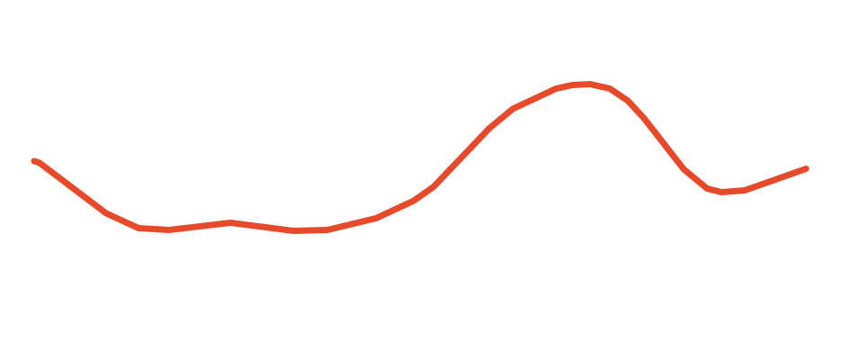

# Free Modular Drift — Alternative C++/PlatformIO Firmware

[](https://github.com/napolitano/eurorack-organic-modulation-firmware/actions/workflows/ci.yml)
[](https://github.com/napolitano/eurorack-organic-modulation-firmware/releases)
[](LICENSE)


> [!NOTE]
> ### With appreciation to Quinn Freedman
> **Drift is Quinn Freedman's instrument.** The original Free Modular hardware, musical concept and Rust firmware are the foundation of this repository. This alternative firmware exists because that work was published openly and is interesting enough to study carefully, preserve and develop further. The goal here is not to erase the upstream implementation, but to keep its identity intact while making the firmware easier to build, test, document and maintain.
>
> - [Free Modular Drift](https://freemodular.org/modules/Drift/)
> - [Quinn Freedman's upstream source](https://github.com/QuinnFreedman/modular/tree/main/modules/Drift)

## What is Drift?

Drift is a **4 HP Eurorack modulation source** that produces evolving 0–10 V control voltages. Its defining idea is controlled movement: instead of choosing between a conventional repeating LFO and completely uncorrelated random values, Drift offers several ways to generate motion that has **continuity, memory, shape or controlled unpredictability**.

The module has two main controls — **Speed** and **Texture** — and CV inputs for both. The default **Classic bank** preserves the four Drift algorithms and gives those controls different musical meanings:

| Algorithm | Character | What makes it useful musically |
|---|---|---|
| **Perlin** | Smooth, organic gradient noise | Slowly evolving modulation without obvious repetition; useful for timbre, filter, spatial and macro movement |
| **Brownian** | Bounded random walk with memory | Wandering modulation that tends to continue from where it already is instead of jumping to unrelated values |
| **Bézier** | Random destinations connected by shaped transitions | Deliberate-looking rises and falls with controllable curvature and segment timing variation |
| **LFO** | Skewable triangle through rising/falling saw | Deterministic periodic modulation when repeatability is more useful than randomness |

Current `Unreleased` development also contains an optional compile-time **Organic bank** with Fractal, Vector, Rain and Attractor modes. Classic remains the default and the 0.1.0 compatibility baseline.

> [!TIP]
> With both configuration switches left open, Drift starts in **Perlin mode**, matching the original hardware default.

## Why this firmware?

The upstream firmware already contains a thoughtful fixed-point implementation of the Drift concept. This project rebuilds it as a **C++17/PlatformIO best-practice firmware** for the original Arduino Nano / ATmega328P hardware, with a different emphasis: behavior should be understandable, mathematically defensible and demonstrably correct.

The project therefore aims to:

- preserve the recognisable Drift instrument and the four original algorithm concepts as the default Classic bank;
- allow compile-time alternative banks to explore new modulation models without changing the original hardware or consuming runtime resources in Classic builds;
- separate portable signal-processing code from Arduino/AVR hardware access;
- verify each algorithm against its mathematical definition, not merely against historical output bytes;
- retain upstream behavior where it represents intentional musical design;
- correct verified numerical, continuity or state-handling problems transparently;
- document upstream findings neutrally, including why a change was or was not made;
- qualify resource use and real-time behavior on the ATmega328P;
- provide reproducible builds, automated tests, release notes and a versioned PDF user manual.

> [!IMPORTANT]
> **Release 0.1.0 is the first official release.** Tag [`v0.1.0`](https://github.com/napolitano/eurorack-organic-modulation-firmware/releases/tag/v0.1.0) publishes the C++17/PlatformIO firmware baseline together with the generated user-manual PDF, checksums and build provenance. The release also includes the completed source-documentation pass, manual-publication fixes and the corrected Arduino entry-point linkage. New work after this tag belongs under `Unreleased` in the changelog.

## Quick start

> [!IMPORTANT]
> **Choose the algorithm before power-up.** The two rear DIP switches are sampled only during startup. Changing them while the module is running does not change the active algorithm; cycle the power after changing the switch setting. The Quick Start below describes the default **Classic bank**. Alternative compile-time banks keep the same physical switch positions but assign different algorithms to them.

### 1. Know the front panel

<p align="center">
  
</p>

| Ref. | Panel element | What it does |
|---:|---|---|
| **1** | **Speed** | Sets the time scale or activity of the selected algorithm. Speed CV is added to the knob where applicable. |
| **2** | **Texture** | Changes the secondary character of the algorithm: octave content, smoothing, curve/timing character or LFO skew. |
| **3** | **Attenuation** | Scales the final output from the full 0–10 V range down to 0 V. |
| **4** | **Speed CV** | 0–5 V control input. Approximately 1 V/oct in Perlin, Bézier and LFO; direct activity control in Brownian. |
| **5** | **Texture CV** | 0–5 V control input, summed with Texture and clamped to the valid control range. In Bézier mode it affects timing variation, not curve shape. |
| **6** | **Output** | Unipolar 0–10 V modulation output. |
| **7** | **LED** | Indicates the instantaneous output level. |

The three stochastic modes create continuously evolving voltages; LFO mode produces a periodic waveform. The final **Attenuation** control acts after the algorithm and therefore does not change the internal motion itself.

<p align="center">
  
</p>

### 2. Choose the algorithm with the rear DIP switches

The original Drift rear PCB provides a two-position DIP switch labelled **1** and **2**. In the diagrams below, **ON is the upper position**. The switches are optional on the original hardware; leaving both positions open is electrically equivalent to `OFF / OFF` and therefore selects **Perlin**, the factory/default mode. This matches the original Free Modular configuration scheme. [The upstream assembly instructions](https://freemodular.org/modules/Drift/docs/assembly_instructions.html) likewise describe the switch as optional and Perlin as the unconnected default.

<table>
<tr>
<td align="center" width="25%"><br><strong>Perlin</strong><br>DIP 1: OFF<br>DIP 2: OFF<br><em>Default</em></td>
<td align="center" width="25%"><br><strong>Brownian</strong><br>DIP 1: ON<br>DIP 2: OFF</td>
<td align="center" width="25%"><br><strong>Bézier</strong><br>DIP 1: OFF<br>DIP 2: ON</td>
<td align="center" width="25%"><br><strong>LFO</strong><br>DIP 1: ON<br>DIP 2: ON</td>
</tr>
</table>

| Rear DIP 1 | Rear DIP 2 | Algorithm | Character |
|---|---|---|---|
| **OFF** | **OFF** | **Perlin** | Smooth organic noise; default |
| **ON** | **OFF** | **Brownian** | Bounded random walk with memory |
| **OFF** | **ON** | **Bézier** | Random destinations joined by shaped transitions |
| **ON** | **ON** | **LFO** | Periodic falling-saw ↔ triangle ↔ rising-saw modulation |

> [!NOTE]
> The table uses the **physical switch numbers printed on the rear DIP package**, because those are what a user sees when configuring the module. Internal firmware names and Arduino pin numbers are implementation details and should not be used to configure the hardware.

### 3. Make the first patch

1. Set the rear DIP switches for the algorithm you want and power the rack normally.
2. Patch **OUT** to a modulation destination such as filter cutoff, wavetable position, waveshaping, effect depth, panning or another CV-controlled parameter.
3. Turn **Attenuation** fully clockwise while learning the mode, then reduce it if the destination needs a smaller modulation range.
4. Set **Speed** around the middle and listen to the time scale of the movement.
5. Sweep **Texture** through its range; its meaning changes substantially between algorithms.
6. Patch a 0–5 V modulation source into **Speed CV** or **Texture CV** when you want Drift's own behavior to evolve under external control.

> [!TIP]
> Drift outputs **0–10 V unipolar CV**. If the destination expects a smaller or bipolar range, use the Attenuation knob and, where necessary, an external attenuverter/offset stage.

### 4. Controls at a glance

| Mode | Speed | Texture knob | Texture CV |
|---|---|---|---|
| **Perlin** | Exponential time scale, approximately 1 V/oct with Speed CV | Blends in a second octave running 4× faster | Adds to octave blend |
| **Brownian** | Raises both movement probability and step size | Controls how tightly the output follows the underlying random-walk target | Adds to smoothing control |
| **Bézier** | Base transition/segment rate, approximately 1 V/oct with Speed CV | Morphs the transition curve **and** contributes to timing variation | Widens timing variation only |
| **LFO** | Periodic frequency, approximately 1 V/oct with Speed CV | Moves the waveform apex from falling saw through triangle to rising saw | Adds to skew/apex position |

For installation details, electrical ranges, full operating notes and the mathematical background of each mode, see the maintained [user manual](docs/manual/README.md).

## Contents

- [What is Drift?](#what-is-drift)
- [Why this firmware?](#why-this-firmware)
- [Quick start](#quick-start)
  - [Know the front panel](#1-know-the-front-panel)
  - [Choose the algorithm with the rear DIP switches](#2-choose-the-algorithm-with-the-rear-dip-switches)
  - [Make the first patch](#3-make-the-first-patch)
  - [Controls at a glance](#4-controls-at-a-glance)
- [Contents](#contents)
- [Algorithms and configuration](#algorithms-and-configuration)
  - [Perlin — smooth organic movement](#perlin--smooth-organic-movement)
  - [Brownian — a random walk with memory](#brownian--a-random-walk-with-memory)
  - [Bézier — random destinations with shaped travel](#bézier--random-destinations-with-shaped-travel)
  - [LFO — deterministic skewed triangle and saws](#lfo--deterministic-skewed-triangle-and-saws)
- [Alternative algorithm banks](#alternative-algorithm-banks)
  - [Organic bank](#organic-bank)
- [Original-firmware findings](#original-firmware-findings)
- [Release history](#release-history)
- [Engineering architecture](#engineering-architecture)
- [Code documentation](#code-documentation)
- [Verification and tests](#verification-and-tests)
- [Algorithm engineering analyses](#algorithm-engineering-analyses)
- [Build](#build)
- [Release artifacts](#release-artifacts)
- [User manual](#user-manual)
- [Release process](#release-process)
- [Upstream and licence](#upstream-and-licence)

## Algorithms and configuration

The four algorithms share the same front panel but deliberately interpret **Speed** and **Texture** differently. That is the core of Drift: the controls remain simple while the underlying motion model changes from smooth correlated noise, through a memory-bearing random walk and shaped random segments, to a conventional periodic LFO.

### Perlin — smooth organic movement

Perlin is the default mode and the closest expression of Drift's original design idea. It generates **continuous gradient noise** rather than jumping between independent random values. The result can wander for a long time without settling into an obvious repeating cycle and without the hard corners of sample-and-hold modulation.

<table>
<tr>
<td align="center" width="50%"><br><strong>Low Texture</strong><br>Broad, slow and very smooth movement</td>
<td align="center" width="50%"><br><strong>Higher Texture</strong><br>More fine movement from the faster octave</td>
</tr>
</table>

**Speed** moves through the noise landscape with an approximately 1 V/oct exponential mapping. **Texture** blends in a second Perlin octave that advances four times faster than the base layer. Low Texture is especially useful for slowly changing timbre, stereo position, effect depth or other parameters where obvious random steps would be distracting; higher Texture keeps the broad motion but adds smaller-scale activity.

### Brownian — a random walk with memory

Brownian mode does not choose a new unrelated voltage on every event. It maintains a bounded target and moves that target up or down in random steps, so the next state depends on where the process already is. A proportional smoother then determines how closely the output follows that wandering target.

<p align="center">
  
</p>

**Speed is intentionally not 1 V/oct in this mode.** Raising Speed increases both the probability of a random-walk event and the possible step size. **Texture** controls the following/smoothing coefficient: low Texture creates substantial inertia and long, drifting movements; high Texture follows the underlying walk more closely and reveals more jitter. Brownian is useful when modulation should feel as though it has momentum and history rather than merely being smooth noise.

### Bézier — random destinations with shaped travel

Bézier mode chooses successive random destination voltages and connects them with monotone cubic transition curves. This creates modulation that has identifiable journeys from one level to the next while remaining non-repeating.

<table>
<tr>
<td align="center" width="50%"><br><strong>Left of centre</strong><br>Transition-emphasised inverse easing</td>
<td align="center" width="50%"><br><strong>Right of centre</strong><br>Smooth easing into and out of destinations</td>
</tr>
</table>

**Speed** sets the base segment rate with the same approximately 1 V/oct mapping used by Perlin and LFO. The **Texture knob has two related jobs**: it continuously morphs the transition curve and, as it moves away from the centre, increases random variation in segment timing. Around 12 o'clock the curve is effectively linear and timing can become regular. **Texture CV affects timing variation only**, so external CV can make the rhythm of the segments more or less irregular without changing the selected curve shape.

The timing variation uses a symmetric triangular distribution in logarithmic speed space. Musically, this means a given amount of variation remains proportional whether the segments are slow or fast rather than corresponding to a fixed number of milliseconds.

### LFO — deterministic skewed triangle and saws

LFO mode is the non-random member of the family. It uses the same simple controls to provide a periodic waveform whose apex can be moved continuously across the cycle.

<p align="center">
  
</p>

**Speed** controls frequency with the approximately 1 V/oct exponential mapping. **Texture** moves from a falling saw at the low end, through a symmetric triangle near the centre, to a rising saw at the high end. Live Texture changes are applied immediately; the firmware remaps phase so the present output level is retained as closely as the fixed-point representation allows. The exact saw endpoints naturally keep the ordinary sawtooth discontinuity at cycle wrap.

Use the LFO when the modulation must repeat predictably or when asymmetric rise/fall timing is itself the musical gesture—for example filter sweeps, PWM, amplitude motion or rhythmic parameter animation.

## Alternative algorithm banks

The firmware can select an entire four-algorithm bank **at compile time**. The rear DIP switches still choose one of four slots at startup; the build decides which algorithm occupies each slot. The default remains `FMD_BANK_CLASSIC`, so ordinary `nanoatmega328new`, `nanoatmega328` and `native` environments preserve the 0.1.0 Classic behavior.

This design is deliberately compile-time rather than runtime. Only the selected bank is owned by `DriftEngine`, so an experimental bank does not reserve algorithm state in a Classic image. It also keeps the hardware interaction unchanged: there is no hidden bank-selection gesture and no additional persistent setting.

> [!IMPORTANT]
> **Attenuation is not a firmware input.** On the original Drift hardware it scales the analogue signal after the DAC. Alternative algorithms may therefore describe it musically as output **Depth** or **Intensity**, but they cannot read its position or use it as an internal parameter such as pitch spread.

<p align="center">
  
</p>

The rear DIP switches therefore select a **slot inside the flashed bank**. They never switch between Classic and Organic; changing bank means flashing the corresponding firmware image.

### Organic bank

The first alternative bank is the **Organic bank**, currently under `Unreleased`. It explores four forms of motion that are intentionally distinct from the Classic set:

| Rear DIP 1 | Rear DIP 2 | Algorithm | Speed | Texture | Attenuation | Character |
|---|---|---|---|---|---|---|
| **OFF** | **OFF** | **Fractal** | Traversal rate | Roughness / multi-scale detail | Depth | Correlated noise layered over three time scales |
| **ON** | **OFF** | **Vector** | Flow rate | Cross-axis coupling | Depth | Deterministic motion through a coupled two-dimensional toroidal field |
| **OFF** | **ON** | **Rain** | Drop-tail decay speed | **Density** | **Intensity** | Shot-noise-inspired random impulses with overlapping decays |
| **ON** | **ON** | **Attractor** | Travel/interpolation rate | Hénon parameter $a$ | Depth | Deterministic nonlinear motion around a Hénon attractor |

The physical DIP truth table is identical to Classic; only the occupants of the four slots change. Selection is still sampled only at startup.

#### Fractal — self-similar motion across scales

Fractal combines three continuous gradient-noise layers at 1×, 4× and 16× phase speed. Texture redistributes a constant total gain from the broad layer toward the faster layers rather than simply increasing output amplitude. At minimum Texture only the macro layer is present; at maximum Texture the fixed weights are 512/320/192 over a denominator of 1024.

```math
F(t)=w_0(T)n(t)+w_1(T)n(4t)+w_2(T)n(16t),\qquad
w_0+w_1+w_2=1
```

The result is procedural fractal noise inspired by multi-scale/fBm construction, but the firmware does **not** claim to implement an exact fractional Brownian motion process.

<p align="center">
  
</p>

#### Vector — coupled two-dimensional flow

Vector maintains two phase coordinates on a torus. Each axis advances continuously, while Texture introduces bounded cross-coupling from the other axis. The scalar output is a projection of both bipolar triangle coordinates.

```math
\phi_x[n+1]=\phi_x[n]+\Delta_x\bigl(1+c(T)y[n]\bigr)
```

```math
\phi_y[n+1]=\phi_y[n]+\Delta_y\bigl(1-c(T)x[n]\bigr)
```

At zero Texture the two phases are uncoupled; increasing Texture bends the path without requiring random numbers. Cross-coupling is bounded so both axes remain forward-moving.

<p align="center">
  
</p>

#### Rain — density-controlled stochastic impulses

Rain treats Texture as **Density** and Speed as the decay speed of the aggregate envelope. Random arrivals add finite impulses; between arrivals the envelope leaks toward zero while preserving fractional decay residual, so quiet tails do not freeze at one code.

```math
y[n+1]=(1-\alpha(S))y[n]+\sum_i A_i\,\delta[n-n_i]
```

The arrival process is a discrete Bernoulli approximation to the impulse-arrival idea associated with shot noise, not a claim of an exact continuous-time Poisson process. The front-panel Attenuation control has a particularly natural role here: because it scales the analogue result, it is the final **Intensity** control.

<p align="center">
  
</p>

#### Attractor — deterministic nonlinear motion

Attractor uses a fixed-point Hénon map. Texture selects $a$ from 1.20 to 1.40 while $b$ remains approximately 0.30; Speed determines how quickly the output travels between successive map states. Linear interpolation prevents the discrete map from becoming an audible/control-rate sample-and-hold staircase.

```math
x_{n+1}=1-a x_n^2+y_n
```

```math
y_{n+1}=b x_n
```

Texture should be understood as **structure**, not a guaranteed monotonic "amount of chaos": nonlinear parameter sweeps can contain qualitatively different regimes. The fixed-point state space is finite, so any digital trajectory is ultimately periodic; the practical question is the structure and length of the orbit at a given Texture setting, not whether the MCU can realise mathematical infinity.

<p align="center">
  
</p>

Build the bank with the dedicated PlatformIO environments, for example:

```bash
pio run -e nanoatmega328new_organic
pio test -e native_organic
```

The compile-time contract and mathematical design are documented in [Organic algorithm bank design](docs/analysis/algorithm-banks/organic-bank-design.md). Each mode also has its own engineering analysis under [docs/analysis/algorithms](docs/analysis/algorithms/README.md).

### Hardware-visible signal order

The portable `ControlFrame` preserves the original hardware-visible ADC order:

1. Speed CV — A4
2. Texture CV — A5
3. Speed knob — ADC6/A6
4. Texture knob — ADC7/A7

The output remains a 12-bit MCP4922 Channel-A value; Channel B is unused. The existing single LED follows the output through an 8-bit gamma table.

## Original-firmware findings

The upstream implementation remains the design reference. The table below summarizes the findings that materially affected this firmware. The wording is intentionally descriptive rather than judgmental; detailed derivations and evidence are in the linked developer analyses.

| Area | Upstream observation | Current treatment |
|---|---|---|
| **Brownian — Texture scaling** | Most of the 10-bit Texture range is interpreted directly as raw Q0.16, followed by a separate direct-tracking regime near the top of the control range. | Normalize the complete 0…1023 control range to a documented smoothing range and remove the abrupt regime change. |
| **Brownian — convergence** | Fractional smoothing movement is discarded, so sufficiently small non-zero corrections can quantize to zero before the target is reached. | Retain fractional residual so mathematically non-zero movement continues to accumulate. |
| **Bézier — timing distribution** | The implementation samples a triangular distribution in logarithmic speed space, although older documentation described it as Gaussian. | Keep the triangular model as the implemented musical design and document it accurately. |
| **Bézier — inverse CDF endpoint** | 256 stored values are used for 256 interpolation intervals, causing the upper interpolation index to clamp at the final entry. | Use 257 boundary samples for 256 intervals so both mathematical endpoints are represented. |
| **Bézier — curve selection** | Crossing the Texture midpoint switches directly between two cubic easing families while a segment is running. | Morph continuously between the cubic responses instead of changing family at a single ADC code. |
| **LFO — live Texture changes** | Skew/Texture is latched at cycle rollover, so changes can be delayed by almost a full cycle at slow rates. | Apply Texture immediately and remap phase to preserve the current output as closely as fixed-point resolution permits. |
| **LFO — startup state** | The constructor uses a fixed initial apex and exposes a first-cycle fixed-point edge around the peak. | Initialize and process the requested shape from the first step, removing the startup-only discontinuity. |
| **Perlin — fade evaluation** | Repeated truncating fixed-point polynomial operations can introduce local one-code reversals in an otherwise monotone quintic fade. | Evaluate the canonical quintic with a single rounded integer expression over the effective phase domain. |
| **Frequency mapping — cost** | Frequency-to-phase conversion uses a 64-bit division in a recurring hot path. This is primarily a performance concern rather than a functional defect. | Use reciprocal multiplication plus a bounded exact correction; tests compare the result with the exact rational reference. |

> [!NOTE]
> A correction is accepted only where the intended mathematics or state behavior can be stated and tested. Differences that are part of Drift's musical character are retained even when another implementation might be possible.

See the [original firmware analysis](docs/analysis/original-firmware-analysis.md) and the [algorithm analyses](docs/analysis/algorithms/README.md) for the full evidence chain. The upstream-finding table applies to the Classic bank; the project-defined Organic algorithms have separate design analyses.

## Release history

| Version | Summary |
|---|---|
| **0.1.0** | Initial C++17/PlatformIO firmware release for Free Modular Drift: four mathematically tested modulation algorithms, documented corrections to verified upstream issues, comprehensive Doxygen/source documentation, native/AVR CI, resource guardrails, engineering analyses, hardened release/manual tooling and a tagged-release PDF user manual. |

The authoritative detailed history is the [changelog](CHANGELOG.md). Version `0.1.0` is published from tag [`v0.1.0`](https://github.com/napolitano/eurorack-organic-modulation-firmware/releases/tag/v0.1.0). Future releases follow the same rule: ordinary commits and pull requests never create a GitHub Release; only a pushed version tag does.

## Engineering architecture

```text
Arduino entry points
        |
FirmwareController              src/platform/nano_atmega328p/
        |
   DriftRuntime                 lib/fmd/application/
        |
    DriftEngine                 lib/fmd/domain/
        |
 compile-time bank
   /    |    |    \
 four selected algorithms
        |
minimal ports                   lib/fmd/ports/
        |
AVR ADC / DAC / LED / tables    src/platform/nano_atmega328p/
```

The portable core never calls `analogRead()`, `digitalWrite()`, `SPI.transfer()`, AVR registers or Arduino timing functions. Hardware dependencies terminate at small ports implemented by the Nano/ATmega328P platform layer.

### Engineering goals

- keep `src/main.cpp` as a minimal composition entry point;
- keep portable production code independent of Arduino/AVR APIs;
- execute the real production core in host-side tests rather than duplicating the algorithms in a test model;
- keep mathematical helper functions production-facing so they can be verified directly;
- maintain strict compiler warnings, sanitizer runs, coverage and requirement-traceability gates;
- measure AVR timing and resource costs before accepting performance-sensitive optimisations.

## Code documentation

Production C++ follows the same documentation discipline used by the Quantizer project: every source file carries a complete provenance/licence header, public and non-obvious APIs use Doxygen contracts, fixed-point units and ranges are stated explicitly, and complex numerical or AVR-specific implementation choices are explained inline. Names favour domain intent over terse implementation shorthand.

The conventions and local Doxygen workflow are documented in [docs/development/code-documentation.md](docs/development/code-documentation.md). CI also runs `scripts/check_code_documentation.py` so file headers, generated-table provenance and readability constraints cannot silently regress.

## Verification and tests

The test strategy distinguishes **mathematical correctness**, **state-machine behavior**, **regression protection**, **system behavior** and **hardware qualification**.

Current native coverage includes:

- dedicated mathematical suites for all four Classic algorithms and all four Organic algorithms;
- shared fixed-point, frequency, RNG and reference-table tests;
- edge-case and long-run state-transition tests;
- property/invariant tests across the control domain;
- regression tests for corrected upstream findings;
- integration and end-to-end runtime tests using the real production core;
- machine-checked acceptance-criteria traceability;
- sanitizer and coverage environments.

The released 0.1.0 Classic baseline contains **88 native test cases**, **32 acceptance criteria**, approximately **99.45% line coverage** and **82.82% branch coverage** for the portable production code. The current `Unreleased` source expands the repository to **107 native test cases across 18 suites** and **37 acceptance criteria** by adding bank-selection and Organic-algorithm verification. Classic and Organic coverage are qualified independently. Coverage is treated as a regression floor, not as a substitute for requirement or mathematical verification.

AVR builds also carry explicit engineering headroom: **Flash must stay at or below 85% (26,112 / 30,720 bytes)** and **static SRAM at or below 65% (1,331 / 2,048 bytes)**. These are repository guardrails, deliberately stricter than the ATmega328P hard limits.

See [README_TESTING.md](README_TESTING.md) and [requirements traceability](docs/testing/requirements-traceability.md).

## Algorithm engineering analyses

Each algorithm has a dedicated developer analysis that starts from the mathematics and then examines the upstream Rust implementation, actual behavior, computational cost, findings, proposed improvements and verification evidence:

- [Perlin noise](docs/analysis/algorithms/perlin-noise-analysis.md)
- [Brownian / bounded random walk](docs/analysis/algorithms/brownian-motion-analysis.md)
- [Bézier random segments](docs/analysis/algorithms/bezier-random-walk-analysis.md)
- [LFO](docs/analysis/algorithms/lfo-analysis.md)
- [Fractal](docs/analysis/algorithms/fractal-analysis.md)
- [Vector](docs/analysis/algorithms/vector-analysis.md)
- [Rain](docs/analysis/algorithms/rain-analysis.md)
- [Attractor / Hénon map](docs/analysis/algorithms/attractor-analysis.md)
- [Organic bank architecture and control contract](docs/analysis/algorithm-banks/organic-bank-design.md)

The common classification policy is documented in [docs/analysis/algorithms/README.md](docs/analysis/algorithms/README.md).

## Build

Classic firmware builds:

```bash
pio run -e nanoatmega328new
pio run -e nanoatmega328
```

Organic firmware builds:

```bash
pio run -e nanoatmega328new_organic
pio run -e nanoatmega328_organic
```

Host verification:

```bash
pio test -e native
pio test -e native_sanitized
pio test -e native_coverage

pio test -e native_organic
pio test -e native_organic_sanitized
pio test -e native_organic_coverage

python scripts/check_requirement_traceability.py
python scripts/check_code_documentation.py
python scripts/check_markdown_footer.py
python scripts/check_markdown_math.py
```

Timing qualification uses `nanoatmega328new_timing` for Classic and `nanoatmega328new_organic_timing` for Organic.

## Release artifacts

Tagged releases publish **both compile-time banks** for both supported Arduino Nano bootloaders. Firmware filenames carry the bank, bootloader and release version so a downloaded HEX cannot be mistaken for another variant:

| Bank | New bootloader | Old bootloader |
|---|---|---|
| **Classic** | `fm-drift-classic-nano-new-bootloader.X.Y.Z.hex` | `fm-drift-classic-nano-old-bootloader.X.Y.Z.hex` |
| **Organic** | `fm-drift-organic-nano-new-bootloader.X.Y.Z.hex` | `fm-drift-organic-nano-old-bootloader.X.Y.Z.hex` |

Matching `.elf` files are included for debugging/provenance. Each release also contains `FIRMWARE-ARTIFACTS.X.Y.Z.md`, **four build-information files** matching the bank/bootloader variants, the versioned user-manual PDF and checksum manifests.

> [!IMPORTANT]
> Flashing chooses **Classic or Organic**. The rear DIP switches then choose one of the four algorithms in that flashed bank. A DIP change cannot move between banks.

## User manual

The maintained end-user source is [docs/manual/drift-user-manual.odt](docs/manual/drift-user-manual.odt). It now documents **both compile-time banks and all eight modes**, including the Organic control mappings, DIP table, mathematical foundations and dedicated vector figures. The source file remains deliberately unversioned; only tagged releases produce a versioned PDF artifact.

The manual repository area contains:

- [publication and typography notes](docs/manual/README.md);
- [CC BY-NC 4.0 manual licence](docs/manual/LICENSE);
- [reusable vector diagrams](docs/manual/assets/README.md).

Only a tagged release `vX.Y.Z` produces `drift-user-manual.X.Y.Z.pdf`; ordinary pushes and pull requests do not build or upload a manual PDF. The release workflow verifies document structure and embedded Ubuntu/Ubuntu Light fonts before publishing it.

## Release process

Ordinary development after a release remains under `## Unreleased` in [CHANGELOG.md](CHANGELOG.md). Release `0.1.0` is produced from tag [`v0.1.0`](https://github.com/napolitano/eurorack-organic-modulation-firmware/releases/tag/v0.1.0); its changelog section contains all changes included in that tag. For future releases, preparation creates the matching versioned changelog section and package metadata before the version tag is pushed.

Releases are triggered **only by pushed version tags**. `.github/workflows/release.yml` has no manual release trigger and builds Classic and Organic firmware for both Nano bootloaders, the versioned manual PDF, bank-specific provenance files and checksum manifests only for the tag being published. Release notes are generated deterministically from the matching changelog section rather than from generic commit-message aggregation.

See [docs/development/release-process.md](docs/development/release-process.md).

## Upstream and licence

This repository is an independent alternative firmware for the original Free Modular Drift hardware and is not an official Free Modular repository.

- Original project and hardware documentation: <https://freemodular.org/modules/Drift/>
- Quinn Freedman's upstream source: <https://github.com/QuinnFreedman/modular/tree/main/modules/Drift>

Firmware code in this repository is distributed under **GPL-3.0-or-later**. See [LICENSE](LICENSE). The maintained end-user manual has its own **CC BY-NC 4.0** licence; see [docs/manual/LICENSE](docs/manual/LICENSE).

<!-- drift-footer:start -->
<p align="center">
  From Munich with 
</p>
<!-- drift-footer:end -->
