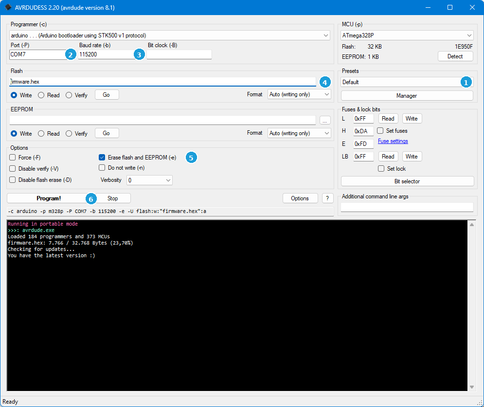

# Updating Drift with AVRDUDESS on Windows 11

[← Installation / bank-switching guide](../README.md) · [Main README](../../../README.md)

This is the Windows 11 x64 end-user path for installing a prebuilt Drift release with **AVRDUDESS**, a graphical front end for AVRDUDE. No compiler, Arduino IDE or PlatformIO installation is required.

> [!IMPORTANT]
> The update has two independent choices: **(1) the algorithm bank in the HEX filename** and **(2) the Nano bootloader variant / baud rate**. After the firmware is installed, the rear DIP switches select one of four algorithms inside that bank.

## Contents

- [Before you start](#before-you-start)
- [Choose the bank and firmware file](#choose-the-bank-and-firmware-file)
- [Remove and isolate Drift](#remove-and-isolate-drift)
- [Connect the Arduino Nano by USB](#connect-the-arduino-nano-by-usb)
- [Install AVRDUDESS](#install-avrdudess)
- [Configure AVRDUDESS](#configure-avrdudess)
- [Program the firmware](#program-the-firmware)
- [Set the rear DIP switches](#set-the-rear-dip-switches)
- [Reinstall the module](#reinstall-the-module)
- [Troubleshooting](#troubleshooting)
- [Bootloader recovery](#bootloader-recovery)

## Before you start

You need:

- the Drift module;
- a data-capable USB cable for the installed Arduino Nano;
- the desired Drift `.hex` file from the [GitHub release](https://github.com/napolitano/eurorack-organic-modulation-firmware/releases);
- [AVRDUDESS](https://github.com/ZakKemble/AVRDUDESS/releases);
- a clean, dry, nonconductive work surface.

> [!CAUTION]
> **TURN THE EURORACK CASE OFF BEFORE REMOVING DRIFT.**

> [!CAUTION]
> **DISCONNECT THE EURORACK RIBBON CABLE BEFORE CONNECTING USB.** Do not power Drift from the Eurorack bus and USB at the same time during this update procedure.

> [!CAUTION]
> **DO NOT TOUCH THE PCB, ARDUINO NANO, HEADERS OR COMPONENTS WHILE USB POWER IS PRESENT.** Handle the removed module by the front-panel edges only.

## Choose the bank and firmware file

First choose the bank:

| Bank | Algorithms |
|---|---|
| Classic | Perlin · Brownian · Bézier · LFO |
| Organic | Fractal · Vector · Rain · Attractor |
| Generative | Turing · Markov · Motif · Urn |
| Ambient | Current · Anchor · Breath · Fog |
| Electronica | Pump · Acid · Shuffle · Polymeter |
| Percussion | Euclid · Repeat · Probability · Humanize |

Then choose the bootloader variant:

| Nano bootloader | Filename ending | Baud |
|---|---|---:|
| New bootloader / Optiboot | `nano-new-bootloader.X.Y.Z.hex` | `115200` |
| Old Nano bootloader | `nano-old-bootloader.X.Y.Z.hex` | `57600` |

For example:

```text
fm-drift-generative-nano-new-bootloader.0.3.0.hex
fm-drift-generative-nano-old-bootloader.0.3.0.hex
```

If you do not know which bootloader is installed, start with the new-bootloader file at `115200`. If AVRDUDESS cannot establish communication, retry with the matching old-bootloader file at `57600`.

## Remove and isolate Drift

1. Switch the Eurorack case **OFF**.
2. If applicable, disconnect its external power adapter or mains lead.
3. Wait until the module and case LEDs are dark.
4. Remove the panel screws.
5. Pull the module forward by the front-panel edges.
6. Disconnect the Eurorack ribbon cable by its connector housing.
7. Put Drift on a clean, dry, nonconductive surface where the PCB cannot touch metal.

> [!WARNING]
> Do not pull on the ribbon cable itself and do not use the Arduino Nano or PCB as a handle.

## Connect the Arduino Nano by USB

The Nano may remain installed on the Drift PCB. With the Eurorack ribbon cable disconnected, connect the USB cable to the Nano and then to the computer.

The Nano is powered by USB for the update. **Do not reconnect the Eurorack ribbon cable while USB is attached.**

> [!TIP]
> A charging-only cable can power the Nano but cannot transfer firmware. If Windows shows no COM port, try a known data cable first.

## Install AVRDUDESS

Download AVRDUDESS from its official Releases page:

<https://github.com/ZakKemble/AVRDUDESS/releases>

The screenshot below is the same numbered AVRDUDESS 2.20 / AVRDUDE 8.1 reference used by the companion Quantizer firmware documentation. It identifies the relevant controls. **Follow the required settings in this guide rather than copying every visible checkbox state from the screenshot.**

## Configure AVRDUDESS

<p align="center">
  
</p>

The blue numbers correspond to:

| No. | Area | Drift update setting |
|---:|---|---|
| **1** | Presets | No preset is required; use the normal/default setup unless you maintain a known-good preset yourself |
| **2** | Port | Select the COM port that appears when the Nano is connected |
| **3** | Baud rate | `115200` for new bootloader, `57600` for old bootloader |
| **4** | Flash file | Select the matching **Drift bank + bootloader** `.hex` file and leave **Write** selected |
| **5** | Erase flash and EEPROM | **OFF** for a normal update; Drift does not require an EEPROM chip erase to change firmware banks |
| **6** | Program! | Starts the upload; wait for AVRDUDE to report successful completion |

Before clicking **Program!**, verify:

| Control | Required value |
|---|---|
| Programmer | `arduino ... (Arduino bootloader using STK500 v1 protocol)` |
| MCU | `ATmega328P` |
| Disable verify (`-V`) | **OFF** |
| Disable flash erase (`-D`) | **ON** |
| Do not write (`-n`) | **OFF** |
| Force (`-F`) | **OFF** |
| EEPROM file | Leave empty |
| Fuses / lock bits | Do not change |
| Additional command-line arguments | Leave empty |

> [!CAUTION]
> **The screenshot shows the location of the Erase option, not the setting you should use. For a normal Drift firmware update, `Erase flash and EEPROM (-e)` must be OFF.**

> [!CAUTION]
> **DO NOT CHANGE FUSES OR LOCK BITS.** They are not part of a normal firmware update.

> [!WARNING]
> Do not use Force (`-F`) to suppress a signature or communication error. Correct the MCU, port, cable, driver or bootloader selection instead.

## Program the firmware

1. Confirm again that the **Eurorack ribbon cable is disconnected**.
2. Confirm the correct COM port.
3. Confirm the correct bootloader baud rate.
4. Confirm the filename contains the intended Drift **bank** and bootloader variant.
5. Confirm `Erase flash and EEPROM (-e)` is **OFF**.
6. Confirm `Disable flash erase (-D)` is **ON** and verification remains enabled.
7. Click **Program!**.
8. Do not move the module, touch its electronics, close AVRDUDESS or disconnect USB while AVRDUDE is writing/verifying.
9. Wait for successful completion. A normal run ends with a completion message such as `avrdude done. Thank you.`

After programming, the Nano resets into the new firmware. Once AVRDUDE has completed, disconnect USB before doing anything with the Eurorack power connection.

## Set the rear DIP switches

With USB disconnected and the module still disconnected from Eurorack power, set the algorithm you want:

The four physical slots are shared by every bank:

| Slot | Rear DIP 1 | Rear DIP 2 |
|---:|---|---|
| 1 | OFF | OFF |
| 2 | ON | OFF |
| 3 | OFF | ON |
| 4 | ON | ON |

| Bank | Slot 1 | Slot 2 | Slot 3 | Slot 4 |
|---|---|---|---|---|
| Classic | Perlin | Brownian | Bézier | LFO |
| Organic | Fractal | Vector | Rain | Attractor |
| Generative | Turing | Markov | Motif | Urn |
| Ambient | Current | Anchor | Breath | Fog |
| Electronica | Pump | Acid | Shuffle | Polymeter |
| Percussion | Euclid | Repeat | Probability | Humanize |

**ON is the upper physical switch position.** The selected bank comes from the HEX you flashed; the DIP pair selects only the algorithm within that bank.

## Reinstall the module

1. Verify USB is disconnected.
2. Keep the Eurorack case **OFF**.
3. Reconnect the Eurorack ribbon cable in the correct orientation.
4. Reinstall Drift without trapping or straining the ribbon cable.
5. Tighten the panel screws normally.
6. Power the case on.
7. Verify that Speed/Texture affect the expected algorithm and consult the matching [bank guide](../../../README.md#algorithm-bank-guides) if needed.

> [!CAUTION]
> **NEVER RECONNECT THE EURORACK POWER BUS WHILE USB IS STILL ATTACHED FOR THIS UPDATE PROCEDURE.** USB first comes off; only then is the rack power cable reconnected with the case off.

## Troubleshooting

### No COM port appears

- Try a known data-capable USB cable and another USB port.
- Close serial monitors, Arduino IDE, PlatformIO, terminal applications or anything else that may own the port.
- Some Nano-compatible boards use CH340/CH341 USB serial hardware and may require a driver.

### AVRDUDE cannot communicate

- Confirm `ATmega328P`.
- Confirm the `arduino` programmer/protocol.
- Confirm the COM port.
- Confirm `115200` + new-bootloader HEX or `57600` + old-bootloader HEX.
- If one bootloader variant fails to communicate, try the other matching file/baud combination.

### Firmware uploaded but the expected algorithm is missing

Check both levels of selection:

1. **Bank:** inspect the flashed HEX filename.
2. **Algorithm:** power Drift off and check both rear DIP switches.

### Upload starts but fails

Do not use `-F`. Fix the communication or configuration problem instead.

## Bootloader recovery

A missing or damaged Nano bootloader is a separate recovery task, not part of a routine bank change. Arduino documents the classic Nano recovery procedure using another AVR-based Arduino as an ISP programmer:

<https://support.arduino.cc/hc/en-us/articles/4841602539164-Burn-the-bootloader-on-UNO-Mega-and-classic-Nano-using-another-Arduino>

## References

- AVRDUDESS: <https://github.com/ZakKemble/AVRDUDESS>
- AVRDUDE documentation: <https://avrdudes.github.io/avrdude/>
- Arduino Nano processor/bootloader selection: <https://support.arduino.cc/hc/en-us/articles/4401874304274-Select-the-right-processor-for-Arduino-Nano>
- Arduino classic Nano bootloader recovery: <https://support.arduino.cc/hc/en-us/articles/4841602539164-Burn-the-bootloader-on-UNO-Mega-and-classic-Nano-using-another-Arduino>

<!-- drift-footer:start -->
<p align="center">
  From Munich with 
</p>
<!-- drift-footer:end -->
